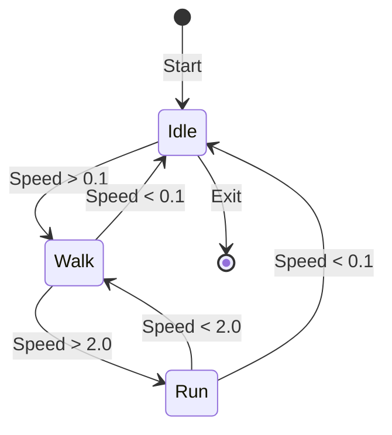
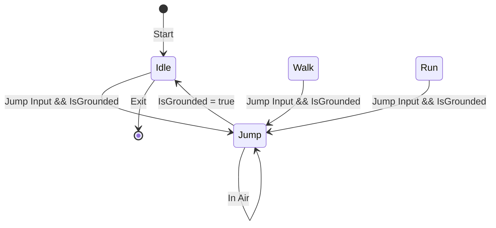

# Unity Animation Flow & State Machine

## 🎯 Overview

This diagram illustrates Unity's animation system workflow, showing how Animator Controllers, state machines, and animation events work together to create smooth character animations.

## 📊 Animation System Flow

```mermaid
flowchart TD
    Start([Animation System]) --> Import[Sprite Import Pipeline]
    
    Import --> SpriteSheet[Sprite Sheet]
    SpriteSheet --> ImportSettings[Import Settings<br/>Texture Type: Sprite<br/>Pixels Per Unit: 16-100<br/>Sprite Mode: Multiple]
    ImportSettings --> SpriteEditor[Sprite Editor<br/>Slice Type: Auto/Grid/Manual<br/>Pivot: Center/Bottom/Custom<br/>Mesh Type: Tight/Full Rect]
    SpriteEditor --> Sprites[Individual Sprites<br/>Idle_1, Idle_2, Idle_3<br/>Walk_1, Walk_2, Walk_3<br/>Jump_1, Jump_2, Jump_3<br/>Attack_1, Attack_2, Attack_3]
    
    Sprites --> Controller[Animator Controller Setup]
    Controller --> Parameters[Parameters<br/>Speed: Float<br/>IsGrounded: Bool<br/>IsJumping: Bool<br/>Attack: Trigger<br/>Direction: Float]
    Parameters --> States[States<br/>Idle State<br/>Walk State<br/>Run State<br/>Jump State<br/>Attack State<br/>Death State]
    States --> Transitions["Transitions<br/>Idle -> Walk: Speed > 0.1<br/>Walk -> Run: Speed > 2.0<br/>Any -> Jump: Jump pressed<br/>Jump -> Idle: IsGrounded = true<br/>Any -> Attack: Attack triggered"]
    
    Transitions --> Events[Animation Event Flow]
    Events --> Timeline[Timeline<br/>Frame 0: Idle_1<br/>Frame 5: Idle_2<br/>Frame 10: Idle_3<br/>Frame 15: Idle_1 Loop]
    Timeline --> AnimationEvents[Animation Events<br/>OnFootstep: Frame 5, 15<br/>OnAttackHit: Frame 8<br/>OnAnimationComplete: Frame 15]
    AnimationEvents --> ScriptMethods[Script Methods<br/>OnFootstep: Play sound<br/>OnAttackHit: Deal damage]
    
    ScriptMethods --> Runtime[Runtime Animation Flow]
    Runtime --> ScriptUpdates[Script Updates<br/>animator.SetFloat Speed<br/>animator.SetBool IsGrounded<br/>animator.SetTrigger Attack]
    ScriptUpdates --> AnimatorController[Animator Controller<br/>Check Parameters<br/>Evaluate Transitions<br/>Change States<br/>Play Animation Clips]
    AnimatorController --> SpriteRenderer[SpriteRenderer Updates<br/>Change Sprite<br/>Update Sorting Order<br/>Handle Flipping]
    SpriteRenderer --> EventsTriggered[Animation Events Triggered<br/>OnFootstep called<br/>OnAttackHit called<br/>OnAnimationComplete called]
    
    style Import fill:#e1f5ff
    style Controller fill:#fff4e1
    style Runtime fill:#e1ffe1
```



## 🎮 State Machine Patterns

### **Basic State Machine**



### **Jump State Machine**



## 🔧 Common Animation Patterns

### **Direction Flipping**
```csharp
public class CharacterController : MonoBehaviour {
    private SpriteRenderer spriteRenderer;
    private Animator animator;

    void Update() {
        float horizontal = Input.GetAxis("Horizontal");

        if (horizontal > 0) {
            spriteRenderer.flipX = false;
        } else if (horizontal < 0) {
            spriteRenderer.flipX = true;
        }

        animator.SetFloat("Speed", Mathf.Abs(horizontal));
    }
}
```

### **Speed-Based Animation**
```csharp
public class PlayerMovement : MonoBehaviour {
    private Rigidbody2D rb;
    private Animator animator;

    void Update() {
        float speed = rb.velocity.magnitude;
        animator.SetFloat("Speed", speed);

        bool isGrounded = CheckGrounded();
        animator.SetBool("IsGrounded", isGrounded);
    }
}
```

### **Animation Events**
```csharp
public class CharacterAnimator : MonoBehaviour {
    [SerializeField] private AudioSource audioSource;
    [SerializeField] private AudioClip footstepSound;
    [SerializeField] private AudioClip attackSound;

    public void OnFootstep() {
        audioSource.PlayOneShot(footstepSound);
    }

    public void OnAttackHit() {
        audioSource.PlayOneShot(attackSound);
        // Deal damage to enemies in range
    }

    public void OnAnimationComplete() {
        // Return to idle state
        animator.SetTrigger("Idle");
    }
}
```

## ⚡ Performance Tips

### **Animation Optimization**
- Use **Sprite Atlas** for multiple sprites
- Keep **Pixels Per Unit** consistent
- Use **Tight** mesh type for better batching
- Limit **Sorting Layers** to essential ones
- Use **Animation Compression** for large clips

### **State Machine Optimization**
- Use **Has Exit Time** for smooth transitions
- Set appropriate **Transition Duration**
- Use **Any State** sparingly
- Group related states in **Sub-State Machines**

## 🔧 Troubleshooting

### **Common Issues**
- **Animation not playing**: Check Animator Controller assignment
- **Transitions not working**: Verify parameter conditions
- **Events not firing**: Check Animation Event setup
- **Flipping issues**: Use SpriteRenderer.flipX instead of negative scale

### **Debug Tips**
- Use **Animator Window** to visualize state machine
- Use **Animation Window** to set up events
- Use **Debug.Log()** in animation event methods
- Use **Animator.GetCurrentAnimatorStateInfo()** for state info

---

**Next**: Learn about [Physics Update Order](./physics_update_order.md) for collision systems
