# Build Pipeline

## Overview

This diagram illustrates Unity's build pipeline from source code to deployable game builds.

## Build Pipeline Flow

```mermaid
flowchart TD
    Source[Source Assets<br/>Scripts: .cs files<br/>Scenes: .unity files<br/>Textures: .png, .jpg<br/>Audio: .wav, .mp3<br/>Models: .fbx, .obj] --> Processing[Asset Processing]
    
    Processing --> P1[1. Import Settings<br/>Configure asset properties]
    P1 --> P2[2. Compression<br/>Reduce file sizes]
    P2 --> P3[3. Platform Conversion<br/>Format for target platform]
    P3 --> P4[4. Dependency Resolution<br/>Link related assets]
    
    P4 --> Compilation[Compilation]
    Compilation --> C1[1. Script Compilation<br/>C# to IL]
    C1 --> C2[2. Shader Compilation<br/>Shader variants]
    C2 --> C3[3. IL2CPP Mobile<br/>IL to native code]
    C3 --> C4[4. Optimization<br/>Remove unused code]
    
    C4 --> Build[Build Generation]
    Build --> B1[1. Scene Bundling<br/>Combine scenes]
    B1 --> B2[2. Asset Bundling<br/>Group related assets]
    B2 --> B3[3. Platform Packaging<br/>Create platform-specific build]
    B3 --> B4[4. Compression<br/>Final size optimization]
    
    B4 --> Deployment[Deployment<br/>Windows: .exe file<br/>Mac: .app bundle<br/>Android: .apk file<br/>iOS: .ipa file<br/>WebGL: Web build]
    
    style Source fill:#e1f5ff
    style Processing fill:#fff4e1
    style Compilation fill:#ffe1e1
    style Build fill:#e1ffe1
    style Deployment fill:#f0e1ff
```



## Build Settings

### Platform Configuration
```csharp
// Android Settings
PlayerSettings.Android.bundleVersionCode = 1;
PlayerSettings.Android.minSdkVersion = AndroidSdkVersions.AndroidApiLevel21;
PlayerSettings.Android.targetSdkVersion = AndroidSdkVersions.AndroidApiLevel33;

// iOS Settings
PlayerSettings.iOS.buildNumber = "1";
PlayerSettings.iOS.targetOSVersionString = "12.0";

// Windows Settings
PlayerSettings.SetScriptingBackend(BuildTargetGroup.Standalone, ScriptingImplementation.Mono);
```

### Build Optimization
- **Strip Engine Code**: Remove unused Unity features
- **Compress Textures**: Reduce texture sizes
- **Optimize Meshes**: Simplify 3D models
- **Audio Compression**: Compress audio files

## Build Profiles

### Development Build
- **Debug Symbols**: Include debugging information
- **Development Console**: Enable console logging
- **Script Debugging**: Allow script debugging
- **Profiler**: Include profiling tools

### Release Build
- **Optimize**: Maximum performance
- **Strip Code**: Remove unused code
- **Compress**: Minimize file size
- **No Debug**: Remove debugging features

## Common Build Issues

### Missing References
- **Cause**: Broken prefab or script references
- **Solution**: Check all references in Inspector

### Build Size Too Large
- **Cause**: Unused assets included
- **Solution**: Use Addressables, optimize textures

### Platform-Specific Errors
- **Cause**: Platform-specific code issues
- **Solution**: Use platform defines, test on target platform

### Performance Issues
- **Cause**: Inefficient code or assets
- **Solution**: Profile and optimize, use object pooling

## Best Practices

### Build Preparation
- Test on target platform regularly
- Use version control for builds
- Document build settings
- Automate build process

### Optimization
- Profile before optimizing
- Use appropriate compression
- Remove unused assets
- Optimize for target platform

---

**Ready to start building?** Check the [Unity Build Settings](https://docs.unity3d.com/Manual/BuildSettings.html) documentation for detailed instructions.
