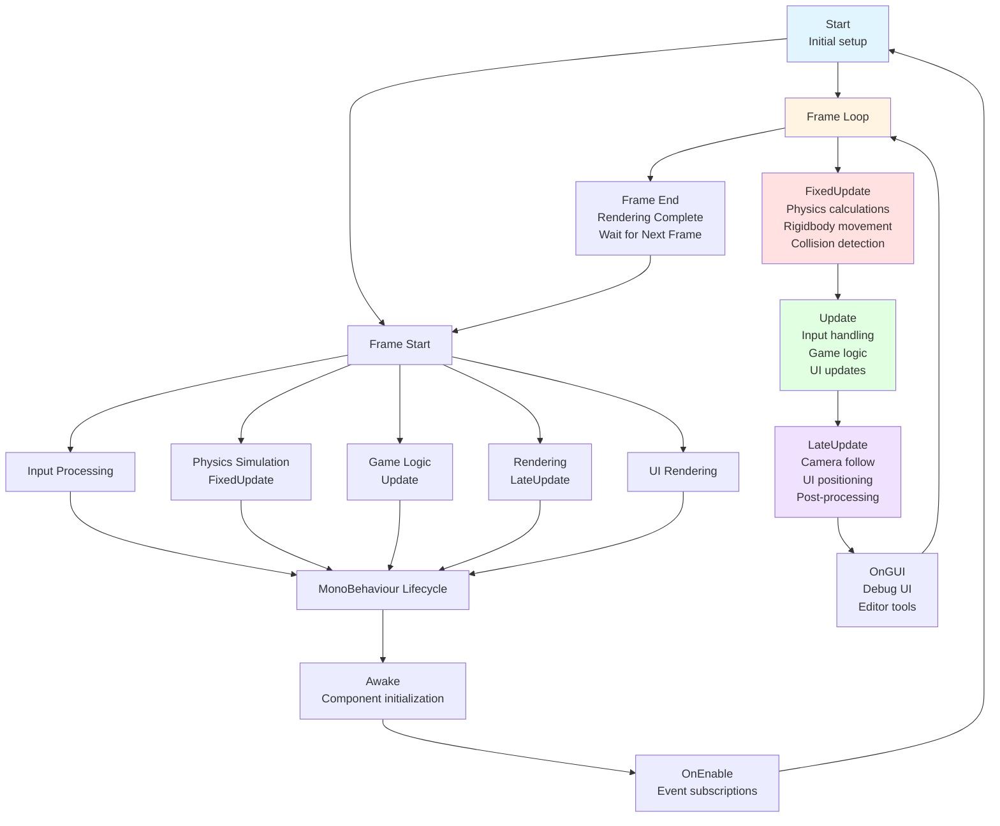
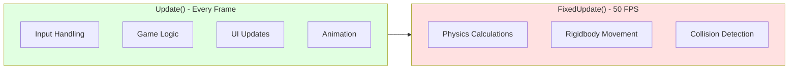

# Unity Game Loop & Execution Order

## 🎯 Overview

This diagram illustrates Unity's core execution model, showing how GameObjects and components are processed each frame, and the order of different update methods.

## 📊 Game Loop Flow



## 🔄 Execution Order Details

### **Awake()**
- Called when GameObject is created
- Called before Start, even if GameObject is disabled
- Use for: Component references, initialization
- **Example**: `GetComponent<Rigidbody2D>()`, setting up references

### **OnEnable()**
- Called when GameObject becomes active
- Called every time GameObject is enabled
- Use for: Event subscriptions, UI setup
- **Example**: `InputAction.performed += OnJump`

### **Start()**
- Called once before first Update
- Called after all Awake() calls
- Use for: Initialization that depends on other objects
- **Example**: Setting initial position, starting coroutines

### **FixedUpdate()**
- Called at fixed intervals (default: 50 FPS)
- Independent of frame rate
- Use for: Physics calculations, Rigidbody movement
- **Example**: `rigidbody2D.velocity = new Vector2(speed, 0)`

### **Update()**
- Called every frame
- Frame rate dependent
- Use for: Input handling, game logic, UI updates
- **Example**: `if (Input.GetKeyDown(KeyCode.Space)) Jump()`

### **LateUpdate()**
- Called after all Update() calls
- Use for: Camera follow, UI positioning
- **Example**: `camera.transform.position = player.transform.position + offset`

### **OnGUI()**
- Called multiple times per frame
- Use for: Debug UI, editor tools
- **Example**: `GUI.Label(new Rect(10, 10, 100, 20), "Debug Info")`

## ⚡ Performance Considerations

### **Update vs FixedUpdate**



### **Best Practices**
- **Use FixedUpdate()** for physics-related code
- **Use Update()** for input and game logic
- **Use LateUpdate()** for camera follow and UI positioning
- **Avoid expensive operations** in Update() loops
- **Use coroutines** for time-based operations

## 🎮 Common Patterns

### **Player Controller Pattern**
```csharp
public class PlayerController : MonoBehaviour {
    void Update() {
        // Input handling
        HandleInput();
    }

    void FixedUpdate() {
        // Physics movement
        MovePlayer();
    }

    void LateUpdate() {
        // Camera follow
        UpdateCamera();
    }
}
```

### **State Machine Pattern**
```csharp
public class GameStateManager : MonoBehaviour {
    void Update() {
        switch (currentState) {
            case GameState.Playing:
                UpdateGameplay();
                break;
            case GameState.Paused:
                UpdatePauseMenu();
                break;
        }
    }
}
```

## 🔧 Troubleshooting

### **Common Issues**
- **Physics jitter**: Use FixedUpdate() for physics
- **Input lag**: Use Update() for input handling
- **Camera stuttering**: Use LateUpdate() for camera follow
- **Performance issues**: Profile Update() methods

### **Debug Tips**
- Use `Debug.Log()` to track execution order
- Use Unity Profiler to identify performance bottlenecks
- Use `Time.deltaTime` for frame-rate independent movement
- Use `Time.fixedDeltaTime` for physics calculations

---

**Next**: Learn about [Animation Flow](./animation_flow.md) for character animation systems
