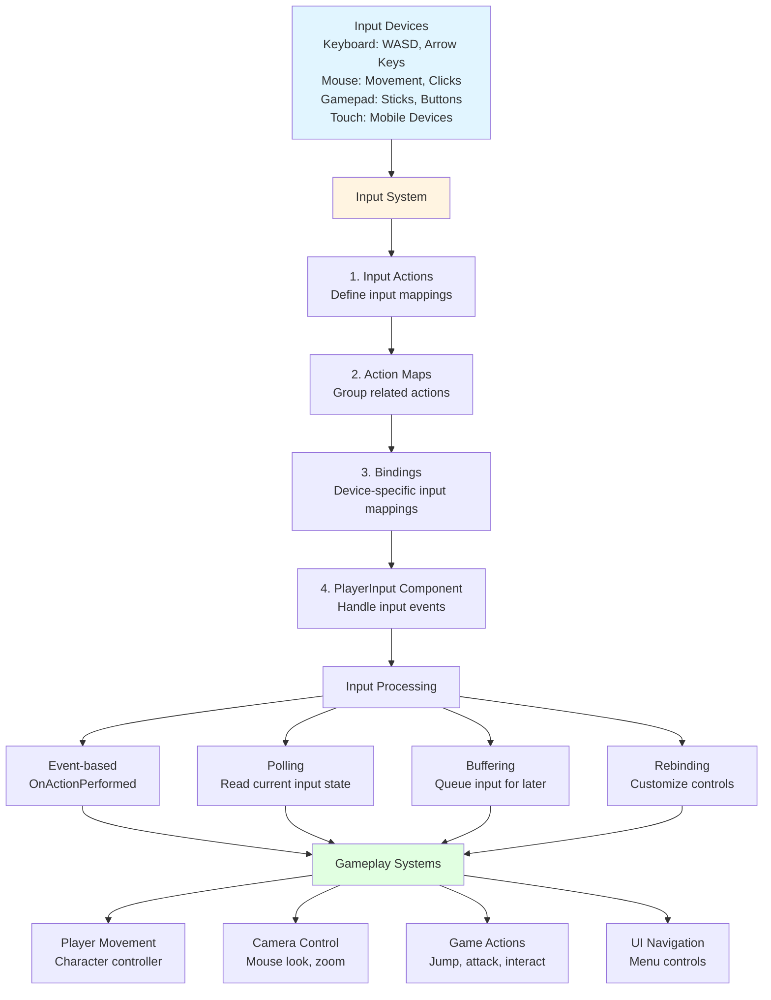

# Input Flow

## Overview

This diagram illustrates how input flows from devices through Unity's Input System to gameplay and UI systems.

## Input Flow Diagram



## Input System Components

### Input Actions Asset
- **Purpose**: Define all input mappings
- **Location**: Project window
- **Usage**: Generate C# class for type-safe input

### Action Maps
- **Player**: Gameplay controls
- **UI**: Menu navigation
- **Debug**: Developer tools

### Bindings
- **Keyboard**: WASD, Space, Shift
- **Mouse**: Movement, clicks
- **Gamepad**: Sticks, face buttons

## Input Patterns

### Event-Based Input
```csharp
public void OnMove(InputAction.CallbackContext context)
{
    Vector2 input = context.ReadValue<Vector2>();
    // Handle movement
}
```

### Polling Input
```csharp
void Update()
{
    Vector2 input = playerInput.actions["Move"].ReadValue<Vector2>();
    // Handle movement
}
```

### Input Buffering
```csharp
private float jumpBufferTime = 0.2f;
private float jumpBufferCounter;

void Update()
{
    if (Input.GetButtonDown("Jump"))
    {
        jumpBufferCounter = jumpBufferTime;
    }

    if (jumpBufferCounter > 0 && isGrounded)
    {
        Jump();
        jumpBufferCounter = 0;
    }

    jumpBufferCounter -= Time.deltaTime;
}
```

## Best Practices

### Input Handling
- Use **event-based** for discrete actions (jump, attack)
- Use **polling** for continuous actions (movement)
- Implement **input buffering** for responsive controls

### UI Integration
- Disable gameplay input when UI is active
- Use separate action maps for UI and gameplay
- Handle input focus properly

### Mobile Considerations
- Support touch input
- Provide on-screen controls
- Handle different screen sizes

---

**Next**: Learn about [UI Navigation Flow](./ui_navigation_flow.md) for menu systems
