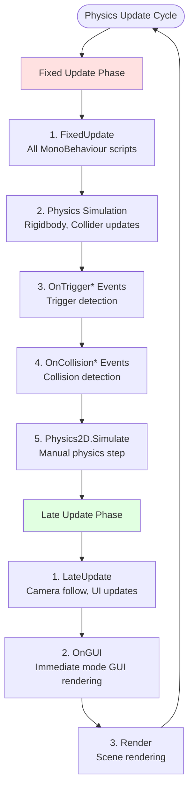

# Physics Update Order

## Overview

This diagram illustrates Unity's physics update cycle and the order of execution for physics-related components and systems.

## Physics Update Cycle

## Key Concepts

### Fixed Timestep
- **Default**: 0.02 seconds (50 FPS)
- **Purpose**: Consistent physics regardless of framerate
- **Adjustment**: Edit → Project Settings → Time → Fixed Timestep

### Physics Update Order
1. **FixedUpdate()** - All MonoBehaviour scripts
2. **Physics Simulation** - Rigidbody movement, collision detection
3. **Trigger Events** - OnTriggerEnter, OnTriggerStay, OnTriggerExit
4. **Collision Events** - OnCollisionEnter, OnCollisionStay, OnCollisionExit

### Best Practices
- Use **FixedUpdate()** for physics-related code
- Use **Update()** for input handling
- Use **LateUpdate()** for camera following
- Avoid expensive operations in FixedUpdate()

## Common Issues

### Physics Jitter
- **Cause**: Inconsistent timestep
- **Solution**: Use FixedUpdate() for physics

### Collision Missed
- **Cause**: Objects moving too fast
- **Solution**: Use Continuous collision detection

### Performance Issues
- **Cause**: Too many physics objects
- **Solution**: Use object pooling, optimize colliders

---

**Next**: Learn about [Input Flow](./input_flow.md) for player input systems
