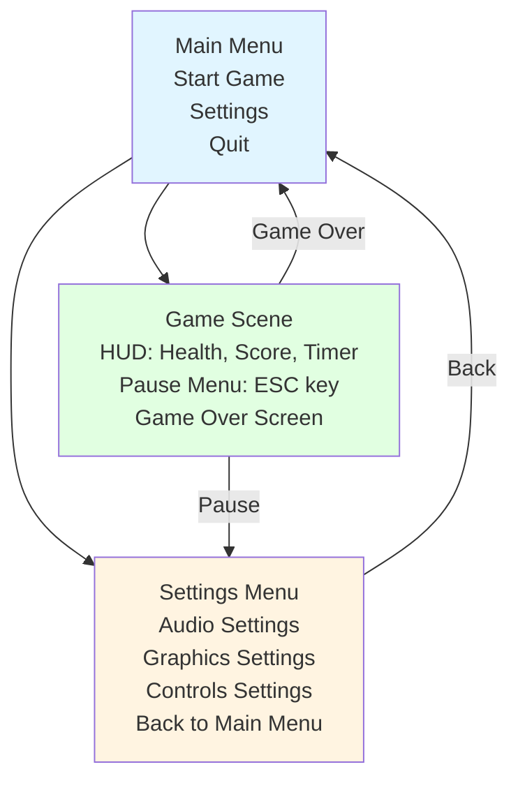
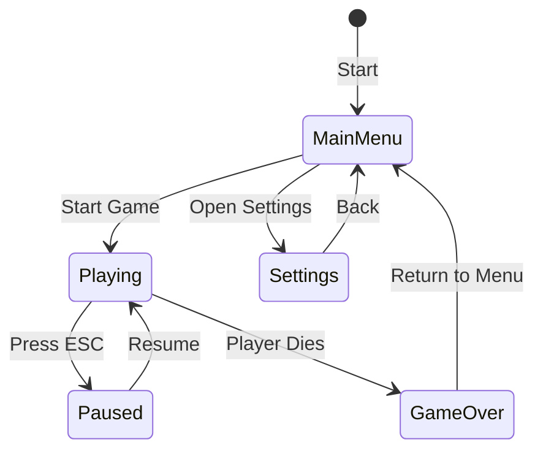

# UI Navigation Flow

## Overview

This diagram illustrates the flow of UI navigation and game state management in Unity games.

## UI Navigation Flow



## UI State Management

### Game States



### State Transitions
- **MainMenu → Playing**: Start new game
- **Playing → Paused**: Press ESC
- **Paused → Playing**: Resume game
- **Playing → GameOver**: Player dies
- **GameOver → MainMenu**: Return to menu

## UI Components

### Canvas Types
- **Screen Space - Overlay**: Always on top
- **Screen Space - Camera**: Follows camera
- **World Space**: 3D positioned

### UI Elements
- **Buttons**: Clickable actions
- **Sliders**: Volume, settings
- **Text**: Display information
- **Images**: Icons, backgrounds
- **Panels**: Group related elements

## Navigation Patterns

### Tab Navigation
```csharp
public class MenuNavigation : MonoBehaviour
{
    public Button[] menuButtons;
    private int currentIndex = 0;

    void Update()
    {
        if (Input.GetKeyDown(KeyCode.Tab))
        {
            currentIndex = (currentIndex + 1) % menuButtons.Length;
            menuButtons[currentIndex].Select();
        }
    }
}
```

### Controller Navigation
```csharp
public class ControllerNavigation : MonoBehaviour
{
    public Button[] buttons;
    private int selectedIndex = 0;

    void Update()
    {
        float vertical = Input.GetAxis("Vertical");
        if (vertical > 0.1f)
        {
            selectedIndex = Mathf.Max(0, selectedIndex - 1);
        }
        else if (vertical < -0.1f)
        {
            selectedIndex = Mathf.Min(buttons.Length - 1, selectedIndex + 1);
        }

        buttons[selectedIndex].Select();
    }
}
```

## Best Practices

### UI Design
- Keep menus simple and intuitive
- Use consistent button sizes and spacing
- Provide visual feedback for interactions
- Support keyboard navigation

### Performance
- Use object pooling for dynamic UI
- Disable unused UI elements
- Optimize UI textures and fonts
- Use UI Toolkit for complex interfaces

### Accessibility
- Support screen readers
- Provide keyboard alternatives
- Use high contrast colors
- Support different input methods

---

**Next**: Learn about [Build Pipeline](./build_pipeline.md) for game deployment
