# Unity Course Learning Path

## 🎯 Course Journey Overview

```mermaid
flowchart TD
    Start([UNITY 2D GAME DEVELOPMENT<br/>Learning Path]) --> L0["🎮 LESSON 0: FUNDAMENTALS<br/>Game Development Mindset<br/>Web -> Game Development Transition<br/>Game Design Basics<br/>Unity Editor Overview<br/>First Hello World Game<br/>📚 Reference -> Example -> Theory -> Lab"]
    
    L0 --> L1["🛠️ LESSON 1: UNITY BASICS<br/>Editor & Project Setup<br/>GameObject/Component Model<br/>MonoBehaviour Lifecycle<br/>Scene Management<br/>Basic Input System keyboard<br/>Simple Camera Follow<br/>Debugging Tools<br/>📚 Reference -> Example -> Theory -> Lab"]
    
    L1 --> L2["🎨 LESSON 2: SPRITES & ANIMATION<br/>Visual Game Elements<br/>Sprite Import Pipeline<br/>Animator Controller<br/>Animation Events<br/>Character Animation System<br/>📚 Reference -> Example -> Theory -> Lab"]
    
    L2 --> L3["⚡ LESSON 3: PHYSICS & COLLISIONS<br/>Game Mechanics<br/>2D Physics System<br/>Collision Detection<br/>Physics Materials<br/>Raycasting & Triggers<br/>📚 Reference -> Example -> Theory -> Lab"]
    
    L3 --> L4["🎮 LESSON 4: ADVANCED INPUT & CAMERA<br/>Professional Player Interaction<br/>Advanced Input System Actions, PlayerInput<br/>Input Handling Patterns & Best Practices<br/>Professional Camera Systems Cinemachine<br/>Camera Bounds & Smoothing<br/>Input Rebinding & UI Focus<br/>📚 Reference -> Example -> Theory -> Lab"]
    
    L4 --> L5["🎯 LESSON 5: UI & COMPLETE GAME<br/>Full Game Development<br/>Complete UI Systems Canvas, Layout Groups<br/>Menus, HUD, Health Bars<br/>Game State Management & Pause System<br/>Save/Load Systems<br/>Build Pipeline & Deployment<br/>📚 Reference -> Example -> Theory -> Lab"]
    
    L5 --> Final["🏆 FINAL PROJECT<br/>Portfolio Development<br/>Complete 2D Game<br/>Portfolio Documentation<br/>Performance Optimization<br/>Build & Deployment<br/>🎯 Showcase your skills!"]
    
    style Start fill:#e1f5ff
    style L0 fill:#fff4e1
    style L1 fill:#e1ffe1
    style L2 fill:#f0e1ff
    style L3 fill:#ffe1e1
    style L4 fill:#fff4e1
    style L5 fill:#e1f5ff
    style Final fill:#f0e1ff
```

---

## 📊 Learning Progression

### **Beginner Level** (Lessons 0-1)
- **Focus**: Understanding game development mindset
- **Skills**: Unity Editor navigation, basic scripting
- **Outcome**: Create simple interactive scenes

### **Intermediate Level** (Lessons 2-3)
- **Focus**: Visual elements and game mechanics
- **Skills**: Animation, physics, collision systems
- **Outcome**: Build responsive character systems

### **Advanced Level** (Lessons 4-5)
- **Focus**: Complete game development
- **Skills**: Input systems, UI, game architecture
- **Outcome**: Develop full 2D games

---

## 🎯 Learning Methodology

### **For Each Lesson:**
1. **📚 Reference** - Quick reference for concepts and APIs
2. **🎮 Example** - Hands-on working example to run and explore
3. **📖 Theory** - Deep dive into concepts and best practices
4. **🔬 Lab** - Practical exercises to reinforce learning

### **Best Practices:**
- **Start with examples** - See it working first
- **Read theory** - Understand the "why"
- **Practice in labs** - Hands-on experience
- **Experiment freely** - Try different approaches
- **Ask questions** - Use community resources

---

## 🚀 Getting Started

### **Step 1: Environment Setup**
- Install Unity Hub
- Install Unity 6.2 (6000.2.10f1)
- Set up your IDE
- Configure Git (optional)

### **Step 2: Start Learning**
- Begin with Lesson 0
- Follow the learning path
- Complete each lesson fully
- Track your progress

### **Step 3: Build Portfolio**
- Complete all lessons
- Build your final project
- Document your journey
- Share your work

---

## 💡 Success Tips

### **Learning Strategy:**
- **Consistent practice** - Regular daily practice
- **Take notes** - Document what you learn
- **Experiment** - Try different approaches
- **Review regularly** - Reinforce learning

### **When Stuck:**
- **Check references** - Look up APIs and concepts
- **Read theory** - Understand the fundamentals
- **Ask community** - Unity forums, Discord, Reddit
- **Debug systematically** - Use Console and Inspector

### **Staying Motivated:**
- **Set goals** - Complete one lesson per week
- **Celebrate progress** - Acknowledge achievements
- **Share work** - Get feedback from others
- **Keep learning** - Game development is a journey

---