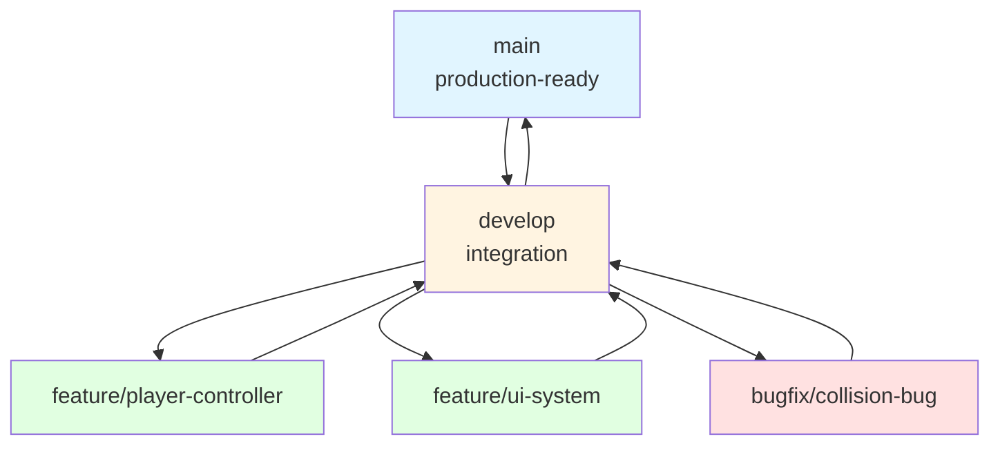
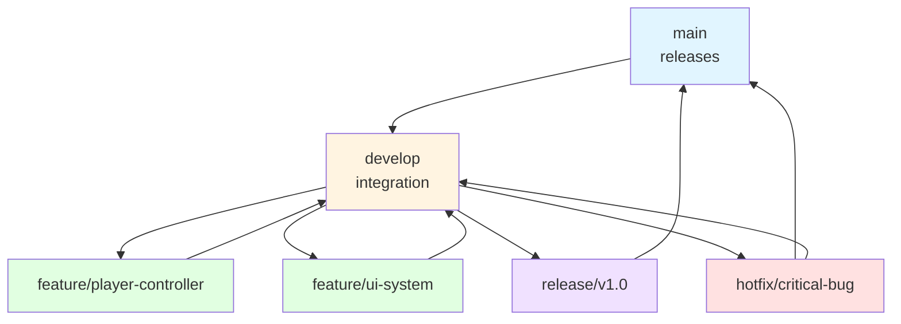

# Version Control Guide for Unity Game Development

## 🎯 Overview

This guide covers version control best practices specifically for Unity game development projects. Learn how to use Git effectively with Unity, avoid common pitfalls, and collaborate smoothly with your team.

---

## 📚 Table of Contents

1. [Why Version Control?](#why-version-control)
2. [Git Basics for Unity](#git-basics-for-unity)
3. [Unity-Specific Setup](#unity-specific-setup)
4. [Workflow Best Practices](#workflow-best-practices)
5. [Handling Unity-Specific Files](#handling-unity-specific-files)
6. [Branching Strategies](#branching-strategies)
7. [Resolving Conflicts](#resolving-conflicts)
8. [Common Mistakes to Avoid](#common-mistakes-to-avoid)

---

## 🤔 Why Version Control?

### Benefits
- ✅ **Backup**: Never lose your work
- ✅ **History**: See what changed and when
- ✅ **Collaboration**: Work with team members
- ✅ **Experimentation**: Try features without fear
- ✅ **Rollback**: Undo mistakes easily
- ✅ **Professional**: Industry standard tool

### Real-World Example
```
Day 1: Working game
Day 2: Added new feature → Broke everything
Day 3: Can't remember what changed
Solution: Git allows you to see exactly what changed and revert
```

---

## 🔧 Git Basics for Unity

### Installation

#### **Windows**
1. Download **Git for Windows**: https://git-scm.com/download/win
2. Install with default settings
3. Or use **GitHub Desktop** (easier GUI): https://desktop.github.com/

#### **Mac**
1. Git comes pre-installed (check with `git --version`)
2. Or install via Homebrew: `brew install git`
3. Or use **GitHub Desktop**

#### **Verify Installation**
```bash
git --version
# Should show: git version 2.x.x or higher
```

### Initial Setup

#### **Configure Git (First Time)**
```bash
# Set your name
git config --global user.name "Your Name"

# Set your email
git config --global user.email "your.email@example.com"

# Set default editor (optional)
git config --global core.editor "code --wait"  # VS Code
```

### Basic Commands

#### **Essential Git Commands**
```bash
# Initialize repository
git init

# Check status
git status

# Add files to staging
git add .                    # Add all files
git add Scripts/Player.cs   # Add specific file

# Commit changes
git commit -m "Add player movement"

# View history
git log

# Create branch
git checkout -b feature/new-feature

# Switch branch
git checkout main

# Merge branch
git merge feature/new-feature
```

---

## 🎮 Unity-Specific Setup

### .gitignore for Unity

#### **Create .gitignore File**
Create a file named `.gitignore` in your project root with this content:

```gitignore
# Unity generated files
[Ll]ibrary/
[Tt]emp/
[Oo]bj/
[Bb]uild/
[Bb]uilds/
[Ll]ogs/
[Uu]ser[Ss]ettings/

# MemoryCaptures can get excessive in size
[Mm]emoryCaptures/

# Asset meta data should only be ignored if the asset store is ignored
# [Aa]ssets/**/*.meta

# Uncomment this line if you wish to ignore the asset store tools plugin
# [Aa]ssets/AssetStoreTools*

# Autogenerated Jetbrains Rider plugin
[Aa]ssets/Plugins/Editor/JetBrains*

# Visual Studio cache directory
.vs/

# Gradle cache directory
.gradle/

# Autogenerated VS/MD/Consulo solution and project files
ExportedObj/
.consulo/
*.csproj
*.unityproj
*.sln
*.suo
*.tmp
*.user
*.userprefs
*.pidb
*.booproj
*.svd
*.pdb
*.mdb
*.opendb
*.VC.db

# Unity3D generated meta files
*.pidb.meta
*.pdb.meta
*.mdb.meta

# Unity3D generated file on crash reports
sysinfo.txt

# Builds
*.apk
*.aab
*.unitypackage
*.app

# Crashlytics generated file
crashlytics-build.properties

# Packed Addressables
[Aa]ssets/[Aa]ddressable[Aa]ssets[Dd]ata/*/*.bin*

# Temporary auto-generated Android Assets
[Aa]ssets/[Ss]treamingAssets/aa.meta
[Aa]ssets/[Ss]treamingAssets/aa/*

# OS generated files
.DS_Store
.DS_Store?
._*
.Spotlight-V100
.Trashes
ehthumbs.db
Thumbs.db
```

#### **Why .gitignore is Important**
- **Library/**: Auto-generated, huge, platform-specific
- **Temp/**: Temporary files, regenerated
- **Build/**: Compiled builds, can be regenerated
- **UserSettings/**: Personal editor preferences

### Unity Editor Settings

#### **Enable Visible Meta Files**
1. **Edit → Project Settings → Editor**
2. **Version Control Mode**: Select **"Visible Meta Files"**
3. **Asset Serialization**: Select **"Force Text"**

**Why?**
- **Meta files** track asset settings (important for collaboration)
- **Text serialization** makes scene/prefab files mergeable

#### **Disable Auto-Refresh (Optional)**
1. **Edit → Preferences → Asset Pipeline**
2. Uncheck **"Auto Refresh"** (prevents constant file changes)

---

## 🔄 Workflow Best Practices

### Daily Workflow

#### **Starting Work**
```bash
# 1. Pull latest changes
git pull origin main

# 2. Create feature branch
git checkout -b feature/your-feature-name

# 3. Start coding!
```

#### **During Work**
```bash
# Make small, frequent commits
git add Scripts/PlayerController.cs
git commit -m "Add jump mechanic"

git add Scripts/PlayerController.cs
git commit -m "Add coyote time to jump"
```

#### **End of Day**
```bash
# 1. Commit all changes
git add .
git commit -m "Complete player movement system"

# 2. Push to remote
git push origin feature/your-feature-name

# 3. Create Pull Request (on GitHub/GitLab)
```

### Commit Best Practices

#### **Good Commit Messages**
```
✅ Good examples:
- "Add player jump with coyote time and variable jump height"
- "Fix collision detection bug when player hits platform edge"
- "Implement main menu UI with button navigation"
- "Refactor GameManager to use singleton pattern"

❌ Bad examples:
- "Update"
- "Fixed stuff"
- "Changes"
- "asdf"
```

#### **Commit Message Format**
```
Short summary (50 chars or less)

More detailed explanation if needed. Wrap at 72 characters.
Explain what and why, not how.

- Bullet points for multiple changes
- Reference issues: Fixes #123
```

#### **When to Commit**
- ✅ **After completing a small feature** (jump mechanic)
- ✅ **After fixing a bug**
- ✅ **After refactoring code**
- ✅ **End of work session**
- ❌ **Don't commit broken code**
- ❌ **Don't commit every single line change**

### Branch Naming Conventions

#### **Recommended Branch Names**
```
feature/player-controller
feature/ui-main-menu
bugfix/collision-edge-case
hotfix/critical-bug
refactor/game-manager
experiment/new-physics
```

#### **Branch Types**
- **feature/**: New features
- **bugfix/**: Bug fixes
- **hotfix/**: Critical urgent fixes
- **refactor/**: Code improvements
- **experiment/**: Trying new things

---

## 📁 Handling Unity-Specific Files

### Scene Files

#### **Scene File Conflicts**
**Problem**: Multiple people editing same scene causes conflicts

**Solutions**:
1. **Assign scene ownership** (one person per scene)
2. **Use scene variants** for experimentation
3. **Use Plastic SCM** (better Unity scene merging)
4. **Communicate** before editing shared scenes

#### **Best Practice**
```
MainMenu.unity → Team Member A
Gameplay.unity → Team Member B
Settings.unity → Team Member C
```

### Prefab Files

#### **Prefab Conflicts**
**Problem**: Multiple people editing same prefab

**Solutions**:
1. **Assign prefab ownership**
2. **Use prefab variants** for experimentation
3. **Merge carefully** and test after

### Script Files

#### **Script Conflicts**
**Problem**: Git merge conflicts in C# files

**Solutions**:
1. **Use proper merge tools** (VS Code, Visual Studio)
2. **Test thoroughly** after resolving
3. **Have team member review** the resolution

### Asset Files

#### **Large Assets**
**Problem**: Large image/audio files slow down Git

**Solutions**:
1. **Use Git LFS** (Large File Storage) for large files
2. **Compress assets** before committing
3. **Use external asset hosting** (optional)

---

## 🌿 Branching Strategies

### Simple Strategy (For Small Teams)



#### **Workflow**
1. **Create feature branch** from `develop`
2. **Work on feature**
3. **Merge to develop** when done
4. **Merge develop to main** when ready to release

### Git Flow (For Larger Teams)



---

## 🔀 Resolving Conflicts

### Understanding Conflicts

#### **What Causes Conflicts?**
- Two people edit the same line
- One person deletes code another person modified
- Conflicting merges

#### **Conflict Markers**
```csharp
<<<<<<< HEAD
// Your changes
private float jumpForce = 10f;
=======
// Their changes
private float jumpForce = 15f;
>>>>>>> feature/player-controller
```

### Resolving Conflicts

#### **Step-by-Step Process**
1. **Identify conflict** (Git will mark it)
2. **Understand both changes** (read the code)
3. **Decide on resolution** (keep yours, theirs, or combine)
4. **Remove conflict markers**
5. **Test the resolution**
6. **Commit the fix**

#### **Example Resolution**
```csharp
// Before (conflicted)
<<<<<<< HEAD
private float jumpForce = 10f;
=======
private float jumpForce = 15f;
>>>>>>> feature/player-controller

// After (resolved - keeping higher value)
private float jumpForce = 15f;
```

### Unity Scene Conflicts

#### **Scene File Conflicts**
**Problem**: Very difficult to merge manually

**Solutions**:
1. **Use Unity's built-in merge tool** (if available)
2. **One person resolves**, others test
3. **Prevent conflicts** by assigning scene ownership
4. **Use Plastic SCM** (better for Unity scenes)

---

## ❌ Common Mistakes to Avoid

### Mistake 1: Committing Library Folder
```bash
# ❌ Don't do this
git add .
git commit -m "Update"

# ✅ Do this
# Make sure .gitignore includes Library/
git add Scripts/
git commit -m "Add player controller"
```

### Mistake 2: Not Using .gitignore
**Problem**: Committing unnecessary files

**Solution**: Always use proper .gitignore

### Mistake 3: Huge Commits
```bash
# ❌ Bad: One huge commit
git commit -m "Complete game"

# ✅ Good: Multiple small commits
git commit -m "Add player movement"
git commit -m "Add jump mechanic"
git commit -m "Add collision detection"
```

### Mistake 4: Not Pulling Before Push
```bash
# ❌ Bad: Push without pulling
git push

# ✅ Good: Pull first
git pull
git push
```

### Mistake 5: Committing Broken Code
```bash
# ❌ Bad: Commit code that doesn't compile
git commit -m "WIP"

# ✅ Good: Only commit working code
# Fix errors first, then commit
```

### Mistake 6: Not Writing Commit Messages
```bash
# ❌ Bad
git commit -m "Update"

# ✅ Good
git commit -m "Fix player getting stuck on platform edges"
```

---

## 🛠️ Tools and Resources

### Git GUI Tools
- **GitHub Desktop**: User-friendly, great for beginners
- **SourceTree**: Powerful, free Git GUI
- **GitKraken**: Beautiful interface, some features paid
- **VS Code Git Integration**: Built-in, works well

### Unity-Specific Tools
- **Plastic SCM**: Unity's recommended version control (better scene merging)
- **Unity Collaborate**: Deprecated, use Git instead

### Learning Resources
- **Git Official Docs**: https://git-scm.com/doc
- **GitHub Guides**: https://guides.github.com/
- **Atlassian Git Tutorial**: https://www.atlassian.com/git/tutorials

---

## ✅ Checklist

### Initial Setup
- [ ] Git installed and configured
- [ ] .gitignore created for Unity
- [ ] Unity Editor settings configured (Visible Meta Files, Force Text)
- [ ] Repository initialized or cloned

### Daily Workflow
- [ ] Pull latest changes before starting
- [ ] Create feature branch for new work
- [ ] Make small, frequent commits
- [ ] Write clear commit messages
- [ ] Push changes regularly
- [ ] Create Pull Request when feature complete

### Before Merging
- [ ] Code compiles without errors
- [ ] No merge conflicts
- [ ] Code reviewed by team member
- [ ] Tested in Unity Editor
- [ ] Commit messages are clear

---

## 🎓 Key Takeaways

1. **Use .gitignore** - Don't commit Library/, Temp/, Build/
2. **Small, frequent commits** - Better than huge commits
3. **Clear commit messages** - Help future you understand changes
4. **Pull before push** - Avoid conflicts
5. **Use branches** - Don't work directly on main
6. **Test after merge** - Make sure everything still works
7. **Communicate** - Tell team what you're working on

---

## 🚀 Next Steps

1. **Set up Git** in your Unity project
2. **Create .gitignore** file
3. **Make your first commit**
4. **Create a feature branch**
5. **Practice the workflow** with small changes
6. **Read code review guide** (`extras/code-review-guide.md`)

---

**Remember**: Version control is a skill that improves with practice. Start simple, make mistakes, learn from them, and you'll become proficient quickly!

