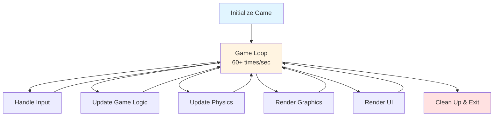
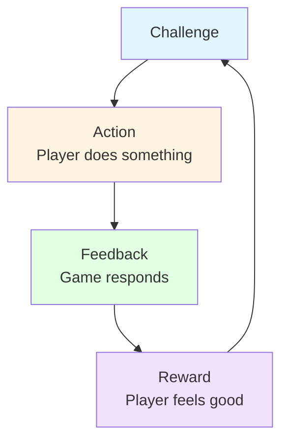

# Theory: Game Development Fundamentals & Mindset

## 🎯 Learning Objectives

- Understand what game development is and the main steps involved
- Learn about popular game engines and their differences
- Explore different game genres and their characteristics
- Understand the key differences between web and game development
- Learn basic game development concepts and terminology
- Navigate Unity Editor for the first time
- Create a simple bouncing ball game
- Understand the game development workflow

---

## 🎮 What is Game Development?

Game development is the process of creating video games, combining creativity, programming, art, design, and technology to create interactive experiences. Unlike traditional software, games focus on player engagement, entertainment, and real-time interactivity.

### **What Makes Game Development Unique?**

- **Real-time Interactivity**: Games respond instantly to player input
- **Visual & Audio Rich**: Heavy emphasis on graphics, animation, and sound
- **Performance Critical**: Must run smoothly at 60 FPS (frames per second)
- **Player Experience Focus**: Success measured by fun, engagement, and player satisfaction
- **Iterative Design**: Constant playtesting and refinement based on player feedback

---

## 📋 Game Development Process: Main Steps

Game development typically follows these key stages:

### **1. Concept & Design** 🎨
- **Game Idea**: Core concept, target audience, platform
- **Game Design Document (GDD)**: Detailed plan of game mechanics, story, art style
- **Prototyping**: Quick tests to validate core gameplay ideas
- **Key Questions**: What's fun? What's the core mechanic? Who plays it?

### **2. Pre-Production** 📝
- **Technical Design**: Architecture, tools, engine selection
- **Art Style**: Visual direction, art pipeline
- **Team Planning**: Roles, timeline, milestones
- **Asset Planning**: What assets are needed (sprites, audio, models)

### **3. Production** 🛠️
- **Core Development**: Building game systems, mechanics, levels
- **Asset Creation**: Art, audio, animations, UI elements
- **Programming**: Game logic, physics, AI, systems
- **Level Design**: Creating game levels, challenges, progression

### **4. Testing & Iteration** 🧪
- **Playtesting**: Get real players to test the game
- **Bug Fixing**: Fix technical issues and glitches
- **Balance Tuning**: Adjust difficulty, mechanics, progression
- **Polish**: Refine visuals, animations, sound effects

### **5. Release & Post-Launch** 🚀
- **Build & Deploy**: Create platform-specific builds (PC, mobile, console)
- **Marketing**: Promote the game, build community
- **Launch**: Release to players
- **Updates & Support**: Fix issues, add content, maintain game

### **Typical Timeline**
- **Indie Game**: 6 months - 2 years
- **Small Team**: 1-3 years
- **AAA Game**: 3-5+ years

**Key Principle**: Start small, iterate often, playtest constantly!

---

## 🎮 Popular Game Engines: Comparison

Game engines are frameworks that provide tools and systems to build games. Here are the three most popular engines:

### **Unity** 🎯
**Best For**: 2D/3D games, mobile games, indie developers, cross-platform

**Strengths:**
- ✅ **Easy to Learn**: Beginner-friendly, extensive documentation
- ✅ **Cross-Platform**: Deploy to 20+ platforms (PC, mobile, console, WebGL)
- ✅ **Large Community**: Massive asset store, tutorials, forums
- ✅ **2D Focus**: Excellent 2D tools and workflow
- ✅ **C# Language**: Modern, type-safe programming language
- ✅ **Free Tier**: Personal edition is free for small developers

**Weaknesses:**
- ❌ **Performance**: Not as optimized as Unreal for AAA 3D games
- ❌ **Visual Scripting**: Less powerful than Unreal's Blueprint
- ❌ **Rendering**: Less advanced graphics than Unreal Engine

**Ideal For**: Indie games, mobile games, 2D games, rapid prototyping, learning game development

---

### **Unreal Engine** 🎬
**Best For**: AAA 3D games, high-end graphics, large teams

**Strengths:**
- ✅ **Stunning Graphics**: Industry-leading rendering, photorealistic visuals
- ✅ **Blueprints**: Powerful visual scripting (no coding required)
- ✅ **AAA Quality**: Used by major studios (Fortnite, Gears of War)
- ✅ **Free**: No royalties until $1M revenue
- ✅ **C++ Access**: Full source code available

**Weaknesses:**
- ❌ **Steep Learning Curve**: More complex, harder for beginners
- ❌ **Large File Size**: Engine is heavy, requires powerful hardware
- ❌ **2D Support**: Less focused on 2D compared to Unity
- ❌ **Mobile**: Less optimized for mobile platforms

**Ideal For**: AAA games, 3D games, photorealistic graphics, large teams, experienced developers

---

### **Godot** 🎪
**Best For**: 2D games, indie developers, open-source enthusiasts

**Strengths:**
- ✅ **Completely Free**: Open-source, no royalties, no restrictions
- ✅ **Lightweight**: Small download, runs on low-end hardware
- ✅ **2D Excellence**: Built-in 2D engine, excellent 2D workflow
- ✅ **GDScript**: Python-like language, easy to learn
- ✅ **Scene System**: Unique node-based architecture

**Weaknesses:**
- ❌ **Smaller Community**: Less tutorials, assets, support than Unity/Unreal
- ❌ **3D Limitations**: 3D capabilities less advanced than Unity/Unreal
- ❌ **Industry Adoption**: Less used in professional studios
- ❌ **Mobile**: Less mature mobile deployment

**Ideal For**: 2D indie games, hobby projects, open-source enthusiasts, learning

---

### **Quick Comparison Table**

| Feature | Unity | Unreal Engine | Godot |
|---------|-------|---------------|-------|
| **Learning Curve** | Easy | Hard | Medium |
| **2D Support** | Excellent | Good | Excellent |
| **3D Support** | Good | Excellent | Good |
| **Mobile** | Excellent | Good | Good |
| **Graphics Quality** | Good | Excellent | Good |
| **Community Size** | Very Large | Large | Medium |
| **Cost** | Free (small) | Free (royalties) | Free |
| **Language** | C# | C++/Blueprint | GDScript/C# |
| **Best For** | Indie, Mobile | AAA, 3D | 2D, Indie |

**Why Unity for This Course?**
- Best balance of ease-of-use and power
- Excellent 2D game development tools
- Large community and learning resources
- Industry-standard for indie and mobile games
- Perfect for learning game development fundamentals

---

## 🎯 Game Genres: Types of Games

Game genres categorize games by their core gameplay mechanics and player experience. Understanding genres helps you:
- **Design Better**: Know what players expect from each genre
- **Choose Mechanics**: Select appropriate systems for your game
- **Target Audience**: Understand who plays each genre

### **Action Games** ⚔️

**Characteristics**: Fast-paced, skill-based, reaction-focused

**Sub-genres:**
- **Shooter (FPS/TPS)**: First/Third Person Shooters (Call of Duty, Overwatch)
- **Fighting**: One-on-one combat (Street Fighter, Tekken)
- **Hack & Slash**: Melee combat, combo systems (Devil May Cry, Bayonetta)
- **Beat 'em Up**: Multiple enemies, side-scrolling (Streets of Rage)

**Core Mechanics**: Combat, reflexes, timing, combo systems

---

### **Platformer** 🦘

**Characteristics**: Jumping, running, navigating obstacles

**Examples**: Super Mario Bros, Celeste, Hollow Knight

**Core Mechanics**:
- **Jumping**: Variable jump height, double jump, wall jump
- **Movement**: Running, dashing, sliding
- **Level Design**: Platforms, obstacles, collectibles
- **Precision**: Timing, spacing, skill-based navigation

**Why Popular**: Simple to understand, hard to master, great for beginners

---

### **Role-Playing Game (RPG)** 🗡️

**Characteristics**: Character progression, story-driven, exploration

**Sub-genres:**
- **Action RPG**: Real-time combat (Dark Souls, The Witcher)
- **Turn-Based RPG**: Strategic combat (Final Fantasy, Pokemon)
- **JRPG**: Japanese-style, story-focused (Persona, Fire Emblem)
- **ARPG**: Loot-focused, hack-and-slash (Diablo, Path of Exile)

**Core Mechanics**:
- **Character Stats**: Health, attack, defense, leveling
- **Equipment**: Weapons, armor, items
- **Story**: Narrative, quests, dialogue
- **Progression**: Experience points, skill trees

---

### **Puzzle Games** 🧩

**Characteristics**: Problem-solving, logic-based, often relaxing

**Examples**: Tetris, Portal, The Witness, Candy Crush

**Core Mechanics**:
- **Problem Solving**: Logic puzzles, pattern recognition
- **No Time Pressure**: Usually (except action-puzzle like Tetris)
- **Progressive Difficulty**: Increasing complexity
- **Satisfaction**: "Aha!" moments when solving

---

### **Strategy Games** 🎯

**Characteristics**: Planning, resource management, tactical thinking

**Sub-genres:**
- **Real-Time Strategy (RTS)**: Command armies in real-time (StarCraft, Age of Empires)
- **Turn-Based Strategy**: Take turns planning (Civilization, XCOM)
- **Tower Defense**: Defend against waves (Plants vs Zombies, Bloons TD)

**Core Mechanics**:
- **Resource Management**: Collect, spend, optimize resources
- **Planning**: Long-term strategy, tactical decisions
- **Units/Entities**: Manage multiple units or systems

---

### **Adventure Games** 🗺️

**Characteristics**: Exploration, story, puzzle-solving

**Sub-genres:**
- **Point & Click**: Click to interact (Monkey Island, Broken Age)
- **Action-Adventure**: Combat + exploration (Zelda, Tomb Raider)
- **Walking Simulator**: Focus on story and atmosphere (Firewatch, What Remains of Edith Finch)

**Core Mechanics**:
- **Exploration**: Discover new areas, secrets
- **Story**: Narrative-driven experience
- **Puzzles**: Environmental puzzles, item combinations

---

### **Simulation Games** 🏗️

**Characteristics**: Realistic systems, management, simulation

**Examples**: The Sims, Cities: Skylines, Flight Simulator, Farming Simulator

**Core Mechanics**:
- **System Simulation**: Realistic behavior of systems
- **Management**: Resources, time, people
- **Realism**: Based on real-world mechanics

---

### **Racing Games** 🏎️

**Characteristics**: Speed, precision, competition

**Sub-genres:**
- **Arcade Racing**: Fun, accessible (Mario Kart, Need for Speed)
- **Simulation Racing**: Realistic physics (Gran Turismo, Forza)
- **Kart Racing**: Casual, power-ups (Mario Kart, Crash Team Racing)

**Core Mechanics**:
- **Vehicle Control**: Steering, acceleration, braking
- **Physics**: Realistic or arcade-style handling
- **Competition**: Racing against AI or players

---

### **Sports Games** ⚽

**Characteristics**: Realistic sports simulation, competition

**Examples**: FIFA, NBA 2K, Madden NFL

**Core Mechanics**:
- **Sports Rules**: Follow real-world sports rules
- **Player Control**: Control athletes, teams
- **Realism**: Authentic gameplay, physics

---

### **Indie & Experimental** 🎨

**Characteristics**: Creative, unique, artistic

**Examples**: Journey, Gris, Celeste, Undertale

**Core Mechanics**: Varies widely, often innovative

**Why Important**: Often push boundaries, inspire new genres

---

### **Genre Hybrids** 🔀

Many modern games combine multiple genres:
- **Action RPG**: Action combat + RPG progression (Dark Souls)
- **Metroidvania**: Platformer + exploration + RPG (Hollow Knight)
- **Roguelike**: Random generation + permadeath + progression (Hades, Dead Cells)

**Key Insight**: Don't be afraid to mix genres! Innovation often comes from combining mechanics.

---

### **Choosing a Genre for Your First Game**

**Recommended for Beginners:**
1. **Platformer**: Simple mechanics, clear goals, easy to prototype
2. **Puzzle Game**: Focus on logic, less complex systems
3. **Top-Down Shooter**: Simple controls, clear objectives

**Avoid for First Game:**
- **RPG**: Complex systems (stats, inventory, quests)
- **RTS**: Managing many systems simultaneously
- **MMO**: Network complexity, large scope

**Tip**: Start with a simple genre, master the basics, then expand!

---

## 🌐 Web vs Game Development

### **Web Development Mindset**
```javascript
// Web: Request/Response Pattern
class WebComponent {
    constructor() {
        this.state = {};
        this.render();
    }

    handleUserAction() {
        // Update state
        this.state = newState;
        // Re-render UI
        this.render();
    }
}
```

**Characteristics:**
- 📡 **Event-driven**: Reacts to user actions
- 🔄 **State-based**: UI reflects data state
- 🌐 **Network-focused**: API calls, data fetching
- 📄 **Page-based**: Navigation between pages
- ⏱️ **Asynchronous**: Promise/async patterns

---

### **Game Development Mindset**
```csharp
// Game: Continuous Loop Pattern
public class GameManager : MonoBehaviour {
    void Update() {
        // Runs 60+ times per second
        // Continuous simulation
        // Real-time updates
    }
}
```

**Characteristics:**
- 🎮 **Loop-driven**: Continuous game loop (60+ FPS)
- 🎯 **Real-time**: Everything happens in real-time
- 🎨 **Visual-focused**: Graphics, animation, effects
- 📊 **State machine**: Game states, player states
- ⚡ **Performance-critical**: 60 FPS = 16ms per frame

---

## 🔄 Key Paradigm Shifts

### **1. Event-Driven → Loop-Driven**

#### **Web Development:**
```javascript
// React to button click
button.onclick = () => {
    updateData();
    renderUI();
};
```

#### **Game Development:**
```csharp
// Continuously check input
void Update() {
    if (Input.GetButtonDown("Jump")) {
        Jump();
    }

    // Update game state continuously
    UpdatePlayer();
    UpdateEnemies();
    UpdateUI();
}
```

---

### **2. State Management**

#### **Web: Component State**
```javascript
// React: Component manages its own state
const [score, setScore] = useState(0);
setScore(score + 1);
```

#### **Game: Global Game State**
```csharp
// Unity: Global game state manager
public class GameManager : MonoBehaviour {
    public static GameManager Instance;
    public int score = 0;

    public void AddScore(int points) {
        score += points;
        // Update UI everywhere
    }
}
```

---

### **3. Component Architecture**

#### **Web: React Components**
```jsx
<Button
    onClick={handleClick}
    className="primary"
/>
```

#### **Game: Unity Components**
```csharp
// GameObject has multiple components
GameObject player;
player.AddComponent<Rigidbody2D>();
player.AddComponent<Collider2D>();
player.AddComponent<PlayerController>();
```

**Similarities:**
- ✅ **Modular**: Each component does one thing
- ✅ **Reusable**: Components can be shared
- ✅ **Composable**: Combine components for behavior

**Differences:**
- 🔄 **Web**: Components are rendered once, re-rendered on state change
- 🎮 **Game**: Components run continuously every frame

---

## 🎮 Game Development Pipeline

### **Traditional Web Development Flow:**
```
Design → Code → Test → Deploy → Monitor
```

### **Game Development Flow:**
```
Design → Prototype → Playtest → Iterate → Polish → Release → Update
```

### **Key Differences:**

#### **1. Iteration Cycles**
- **Web**: Deploy once, update as needed
- **Game**: Continuous iteration based on playtesting

#### **2. Testing Approach**
- **Web**: Functional testing, automated tests
- **Game**: Playtesting, feel testing, balance testing

#### **3. Performance Focus**
- **Web**: Page load time, API response time
- **Game**: Frame rate (60 FPS), consistent performance

#### **4. User Experience**
- **Web**: Information architecture, usability
- **Game**: Gameplay feel, player engagement, fun factor

---

## 🎯 Core Game Development Concepts

### **1. Game Loop**

Every game runs in a continuous loop:



**Key Point**: Everything happens in this loop, continuously, at 60+ frames per second.

---

### **2. Frames Per Second (FPS)**

- **Target**: 60 FPS = 16.67ms per frame
- **Reality**: Each frame must complete all work in ~16ms
- **Challenge**: Balance visuals, gameplay, and performance

**Web Analogy**: Like React's render cycle, but 60+ times per second!

---

### **3. Delta Time**

```csharp
// Time.deltaTime = time since last frame
transform.position += Vector3.right * speed * Time.deltaTime;

// Ensures consistent movement regardless of FPS
// 5 units/second at 60 FPS = 5 units/second at 30 FPS
```

**Why Important**: Makes movement smooth regardless of frame rate.

---

### **4. GameObject & Component Model**

```csharp
// GameObject = container
GameObject player = new GameObject("Player");

// Components = behaviors/features
player.AddComponent<Rigidbody2D>();  // Physics
player.AddComponent<SpriteRenderer>(); // Visual
player.AddComponent<PlayerController>(); // Logic
```

**Web Analogy**: GameObject = HTML element, Components = CSS classes + JavaScript behavior

---

## 🎨 Unity Editor Overview

### **Key Windows**

#### **1. Scene View**
- **Purpose**: Design your game world
- **Web Analogy**: Like a design tool (Figma, Sketch)
- **Use**: Place objects, arrange layout

#### **2. Game View**
- **Purpose**: See what the player sees
- **Web Analogy**: Like browser preview
- **Use**: Test your game in real-time

#### **3. Hierarchy**
- **Purpose**: List of all GameObjects in scene
- **Web Analogy**: Like DOM tree in DevTools
- **Use**: Navigate scene structure

#### **4. Inspector**
- **Purpose**: Edit selected GameObject properties
- **Web Analogy**: Like CSS property panel
- **Use**: Modify components, adjust values

#### **5. Project**
- **Purpose**: All assets (sprites, scripts, audio)
- **Web Analogy**: Like file explorer
- **Use**: Manage assets, organize files

#### **6. Console**
- **Purpose**: Debug messages, errors, warnings
- **Web Analogy**: Like browser console
- **Use**: Debug code, see errors

---

## 🎮 Basic Game Development Workflow

### **Step 1: Design**
- What kind of game?
- What's the core mechanic?
- Who is the player?

### **Step 2: Prototype**
- Build simplest version
- Test core mechanic
- Iterate quickly

### **Step 3: Playtest**
- Get feedback
- Observe player behavior
- Identify issues

### **Step 4: Iterate**
- Fix problems
- Add features
- Improve gameplay

### **Step 5: Polish**
- Visual effects
- Sound effects
- Smooth animations

### **Step 6: Release**
- Build for platforms
- Deploy
- Get feedback

---

## 💡 Mental Models for Game Development

### **1. Time-Based, Not Event-Based**

**Web Thinking**: "When user clicks, do X"
```javascript
button.onclick = () => { doSomething(); };
```

**Game Thinking**: "Every frame, check if user clicked, then do X"
```csharp
void Update() {
    if (Input.GetButtonDown("Jump")) {
        Jump();
    }
}
```

---

### **2. Continuous Simulation**

**Web**: Reacts to events
**Game**: Simulates world continuously

**Example**: Physics
- **Web**: Calculate position when needed
- **Game**: Update physics every frame (60 times/sec)

---

### **3. Visual Feedback is Critical**

**Web**: Show data, inform user
**Game**: Create experience, entertain user

**Key Principle**: Every action should have visual/audio feedback

---

## 🎯 Game Design Basics

### **Core Gameplay Loop**



**Example**: Platformer
- **Challenge**: Reach goal
- **Action**: Jump, move
- **Feedback**: Character moves, animations play
- **Reward**: Progress, collectibles, completion

---

## 🔧 Unity-Specific Concepts

### **1. Scenes**
- **Purpose**: Different game states/levels
- **Web Analogy**: Like pages/routes
- **Examples**: MainMenu, GameLevel1, GameOver

### **2. Prefabs**
- **Purpose**: Reusable GameObject templates
- **Web Analogy**: Like React components or templates
- **Use**: Create once, use many times

### **3. Components**
- **Purpose**: Modular behaviors
- **Web Analogy**: Like CSS classes or React hooks
- **Examples**: Rigidbody2D, SpriteRenderer, AudioSource

### **4. Scripts**
- **Purpose**: Custom game logic
- **Web Analogy**: Like JavaScript functions/classes
- **Language**: C# (similar syntax to JavaScript)

---

## 📊 Comparison Table

| Aspect | Web Development | Game Development |
|--------|----------------|------------------|
| **Execution Model** | Event-driven | Loop-driven (60+ FPS) |
| **Performance Focus** | Page load, API response | Frame rate (16ms/frame) |
| **State Management** | Component state | Global game state |
| **UI Updates** | On state change | Every frame |
| **User Input** | Event listeners | Continuous polling |
| **Rendering** | DOM updates | Graphics rendering |
| **Testing** | Unit tests, E2E | Playtesting, feel testing |
| **Deployment** | Web server | Platform-specific builds |

---

## 🎓 Transition Tips for Web Developers

### **1. Think in Frames, Not Events**
- Every frame matters
- Performance is critical
- Smoothness > Features

### **2. Embrace the Loop**
- Game loop is your friend
- Use Update() wisely
- Optimize for 60 FPS

### **3. Visual Feedback is Key**
- Every action needs feedback
- Polish makes difference
- Animation is important

### **4. Test by Playing**
- Code works ≠ Game feels good
- Playtest constantly
- Iterate based on feel

### **5. Performance Matters**
- Profile early
- Optimize bottlenecks
- Target platform matters

---

## 🚀 Next Steps

Now that you understand the fundamentals:

1. **Navigate Unity Editor**: Get comfortable with windows
2. **Create First Game**: Simple bouncing ball (see example/)
3. **Understand Game Loop**: See how Update() works
4. **Move to Lesson 1**: Learn Unity technical basics

---

**Ready to start?** Check out the `example/` folder for a simple bouncing ball game!
