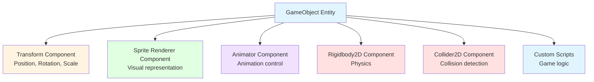
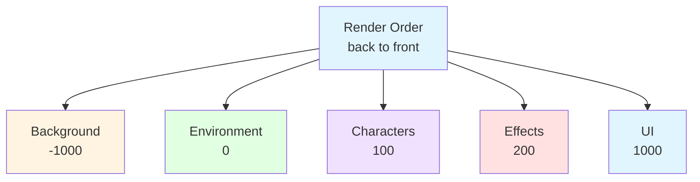
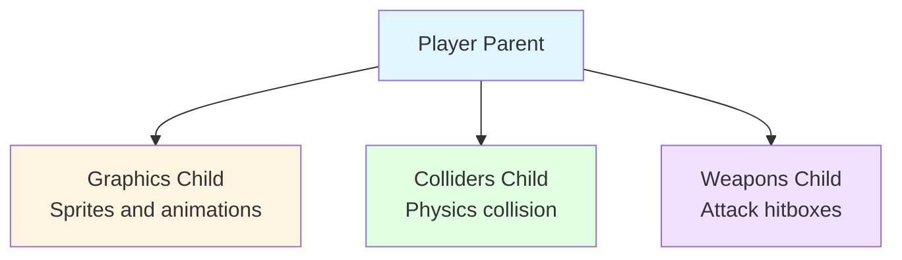
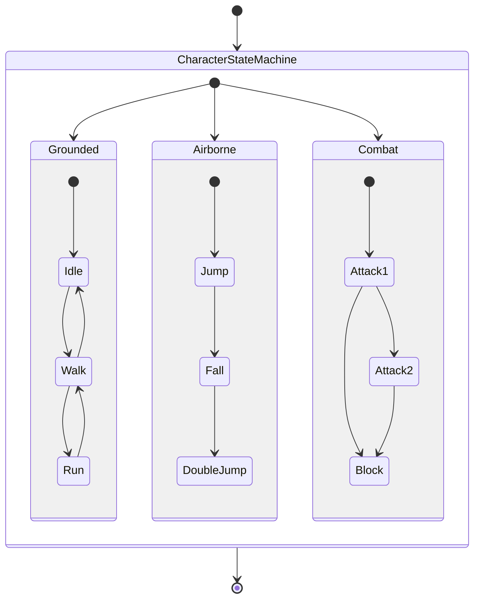

# Theory: 2D Sprites, Animation & Components

## 🎯 Learning Objectives

After completing this lesson, students will be able to:
- Manage and configure 2D sprite sheets
- Create animations using the Animation window
- Set up Animator Controller to manage character states
- Understand Unity's Component System in 2D context
- Implement basic 2D character movement with animations

---

## 1. Unity Component System In-Depth

### Component-Based Architecture

Unity uses the **Entity-Component-System (ECS)** pattern:



### Advantages of Component System

- **Modularity**: Each component has separate responsibility
- **Reusability**: Components can be reused across multiple GameObjects
- **Flexibility**: Easy to add/remove features
- **Maintainability**: Easier to maintain and debug

### Component Lifecycle

```csharp
public class ExampleComponent : MonoBehaviour
{
    void Awake()    // Called when component is created
    void Start()    // Called before first frame update
    void Update()   // Called once per frame
    void OnEnable() // Called when object becomes active
    void OnDisable() // Called when object becomes inactive
    void OnDestroy() // Called when object is destroyed
}
```

---

## 2. Sprite Management and Configuration

### 2.1 Sprite Import and Configuration

#### Texture Import Settings for 2D Sprites

**Texture Type**: `Sprite (2D and UI)`

**Sprite Mode Options:**
- **Single**: One sprite per texture file
- **Multiple**: Sprite sheet with multiple sprites
- **Polygon**: Custom mesh shape for sprite

#### Pixels Per Unit (PPU)
```
PPU = Number of pixels corresponding to 1 Unity unit

Examples:
- 32 PPU: Pixel art games, retro style
- 100 PPU: Unity default, balanced
- 256 PPU: High resolution games
```

#### Filter Mode for 2D
- **Point (no filter)**: Sharp edges, pixel perfect (pixel art)
- **Bilinear**: Smooth scaling (vector-style art)

### 2.2 Sprite Sheet Workflow

#### Creating Sprite Sheet from Multiple Images

1. **Import** all individual sprites
2. **Sprite Packer** (Window → 2D → Sprite Packer)
3. **Auto-generate** sprite sheets
4. **Optimize** texture memory usage

#### Slicing Sprite Sheets

**Automatic Slicing:**
```
Sprite Editor → Slice → Type: Automatic
- Detects individual sprites in sheet
- Creates separate sprite assets
```

**Grid Slicing:**
```
Sprite Editor → Slice → Type: Grid By Cell Size
- Pixel Size: 32x32, 64x64, etc.
- Uniform sprite sizes
```

**Manual Slicing:**
```
Sprite Editor → Drag to create rectangles
- Custom shapes and sizes
- Precise control over boundaries
```

---

## 3. 2D Animation System

### 3.1 Animation Workflow Overview

Unity 2D Animation workflow consists of 3 main components:

1. **Animation Clips**: Contains keyframes and animation data
2. **Animator Component**: Attached to GameObject to play animations
3. **Animator Controller**: State machine managing animation transitions

### 3.2 Animation Window

**Open Animation Window:**
`Window → Animation → Animation`

#### Key Concepts:

**Timeline**: Horizontal axis showing time (seconds/frames)
**Properties**: Vertical axis showing animated properties
**Keyframes**: Points where values change
**Curves**: Interpolation between keyframes

#### Animation Properties for 2D:
- **Sprite Renderer.Sprite**: Sprite animation (frame by frame)
- **Transform.Position**: Movement animations
- **Transform.Scale**: Size changes
- **Sprite Renderer.Color**: Color/alpha changes

### 3.3 Creating Frame-by-Frame Animation

#### Step-by-Step Process:

1. **Select GameObject** with Sprite Renderer
2. **Open Animation Window**
3. **Create New Animation Clip**
4. **Add Property**: Sprite Renderer → Sprite
5. **Set Keyframes**:
   - Frame 0: First sprite
   - Frame 10: Second sprite
   - Frame 20: Third sprite
6. **Configure Sample Rate**: 12 FPS for traditional animation

#### Animation Settings:
```
Sample Rate: 12 FPS (traditional 2D animation)
Wrap Mode: Loop (for idle, walk animations)
           Once (for death, attack animations)
```

### 3.4 Animation Curves and Interpolation

#### Curve Types:
- **Linear**: Constant speed change
- **Ease In/Out**: Smooth acceleration/deceleration
- **Custom**: Manual control with Bezier curves

#### 2D Animation Curves Usage:
```csharp
// Position movement with easing
AnimationCurve jumpCurve = AnimationCurve.EaseInOut(0f, 0f, 1f, 1f);
```

---

## 4. Animator Controller System

### 4.1 State Machine Concept

**Animator Controller** is a **Finite State Machine (FSM)**:

```
States: Idle → Walk → Jump → Fall → Idle
Transitions: Conditions for state changes
Parameters: Variables controlling transitions
```

### 4.2 Animation States

#### Common Character States:
- **Idle**: Character standing still
- **Walk/Run**: Character moving horizontally
- **Jump**: Character jumping up
- **Fall**: Character falling down
- **Attack**: Character attacking
- **Death**: Character dying

#### State Properties:
- **Motion**: Animation clip to play
- **Speed**: Playback speed multiplier
- **Foot IK**: Inverse kinematics for feet (advanced)

### 4.3 Animator Parameters

#### Parameter Types:

**Bool**: True/false conditions
```csharp
animator.SetBool("IsWalking", true);
```

**Int**: Integer values
```csharp
animator.SetInteger("AttackType", 2);
```

**Float**: Decimal values
```csharp
animator.SetFloat("Speed", 5.5f);
```

**Trigger**: One-time events
```csharp
animator.SetTrigger("Jump");
```

### 4.4 Animation Transitions

#### Transition Settings:

**Has Exit Time**:
- `true`: Wait for current animation to finish
- `false`: Transition immediately

**Transition Duration**:
- `0`: Instant transition
- `0.1-0.3`: Smooth blending

**Transition Offset**: Start point of next animation

#### Condition Examples:
```
Idle → Walk: IsWalking == true
Walk → Idle: IsWalking == false
Idle → Jump: JumpTrigger (trigger)
Jump → Fall: IsGrounded == false
```

---

## 5. Sprite Renderer Component

### 5.1 Sprite Renderer Properties

#### Core Properties:
- **Sprite**: Reference to sprite asset
- **Color**: Tint color (RGBA)
- **Flip X/Y**: Mirror sprite horizontally/vertically
- **Material**: Custom material for effects

#### Advanced Properties:
- **Draw Mode**: Simple, Sliced, Tiled
- **Size**: Custom size (when not using sprite's native size)
- **Tile Mode**: Adaptive, Continuous (for tiling)

### 5.2 Sorting and Layering

#### Sorting Layer System:



#### Order in Layer:
- **Player**: 0
- **Enemy**: -1 (behind player)
- **Player Effects**: 1 (in front of player)

#### Code Examples:
```csharp
SpriteRenderer sr = GetComponent<SpriteRenderer>();

// Change sprite
sr.sprite = newSprite;

// Flip character
sr.flipX = true;

// Change sorting
sr.sortingLayerName = "Characters";
sr.sortingOrder = 5;

// Fade effect
sr.color = new Color(1f, 1f, 1f, 0.5f); // 50% alpha
```

---

## 6. Transform Component in 2D

### 6.1 2D Transform Properties

#### Position (X, Y, Z):
- **X**: Left (-) to Right (+)
- **Y**: Down (-) to Up (+)
- **Z**: Depth (usually kept at 0 for 2D)

#### Rotation (Z-axis):
- **0°**: Facing right
- **90°**: Facing up
- **180°**: Facing left
- **270°**: Facing down

#### Scale (X, Y, Z):
- **1, 1, 1**: Original size
- **2, 2, 1**: Double size
- **-1, 1, 1**: Flipped horizontally

### 6.2 Transform Hierarchy

#### Parent-Child Relationships:



#### Local vs World Space:
- **Local**: Relative to parent
- **World**: Absolute position in scene

```csharp
// Local position (relative to parent)
transform.localPosition = new Vector3(1f, 0f, 0f);

// World position (absolute)
transform.position = new Vector3(5f, 3f, 0f);
```

---

## 7. 2D Character Movement Implementation

Bridge between input, physics (Rigidbody2D), and animation parameters.

### 7.1 Movement script

```csharp
using UnityEngine;

public class Character2D : MonoBehaviour
{
    public float moveSpeed = 5f;

    private Rigidbody2D rb2D;
    private SpriteRenderer spriteRenderer;
    private Animator animator;

    void Awake()
    {
        rb2D = GetComponent<Rigidbody2D>();
        spriteRenderer = GetComponent<SpriteRenderer>();
        animator = GetComponent<Animator>();
    }

    void Update()
    {
        float horizontal = Input.GetAxis("Horizontal");

        // Movement
        rb2D.velocity = new Vector2(horizontal * moveSpeed, rb2D.velocity.y);

        // Flip sprite
        if (horizontal != 0)
            spriteRenderer.flipX = horizontal < 0;

        // Simple walk animation
        bool isWalking = Mathf.Abs(horizontal) > 0.1f;
        animator.SetBool("IsWalking", isWalking);
    }
}
```


### 7.2 Animator parameters

Common parameters you’ll use:

- `IsWalking` (Bool) – true when character is moving horizontally.  
- `IsGrounded` (Bool) – set from a simple ground check in physics lesson.  
- `Speed` (Float) – magnitude of horizontal velocity, useful for blend trees.  
- `JumpTrigger` (Trigger) – fired once when jumping.

Configure transitions in the Animator window. For more advanced control, see `lesson2-sprites-animation/example/Character2D.cs` and the sample project.

---

## 8. 2D Collision Detection Basics

### 8.1 Collider2D Components

#### Box Collider 2D:
- **Rectangular** collision shape
- **Best for**: Platforms, walls, rectangular characters

#### Circle Collider 2D:
- **Circular** collision shape
- **Best for**: Balls, circular objects, coins

#### Polygon Collider 2D:
- **Custom shape** based on sprite outline
- **Best for**: Complex shaped objects

### 8.2 Collision vs Trigger

#### Collision (Solid):
- **Physics response**: Objects bounce/stop
- **Use for**: Walls, platforms, solid objects
- **Events**: `OnCollisionEnter2D()`, `OnCollisionStay2D()`, `OnCollisionExit2D()`

#### Trigger (Ghost):
- **No physics response**: Objects pass through
- **Use for**: Collectibles, sensors, damage areas
- **Events**: `OnTriggerEnter2D()`, `OnTriggerStay2D()`, `OnTriggerExit2D()`

```csharp
// Collision example
void OnCollisionEnter2D(Collision2D collision)
{
    if (collision.gameObject.tag == "Ground")
    {
        isGrounded = true;
    }
}

// Trigger example
void OnTriggerEnter2D(Collider2D other)
{
    if (other.tag == "Coin")
    {
        CollectCoin(other.gameObject);
    }
}
```

---

## 9. Best Practices for 2D Animation

### 9.1 Performance Optimization

#### Sprite Atlas Usage:
```
Benefits:
✅ Reduced draw calls
✅ Better memory usage
✅ Faster loading times
✅ Mobile optimization
```

#### Animation Optimization:
- ✅ **Reuse animations**: Share common animations between characters
- ✅ **Optimize keyframes**: Only animate necessary properties
- ✅ **Use compression**: Keyframe reduction for smooth curves
- ✅ **LOD system**: Simplified animations when far from camera

### 9.2 Animation Organization

#### Naming Conventions:
```
Animation Clips:
- Character_Idle
- Character_Walk
- Character_Jump
- Character_Attack_01

Animator Parameters:
- IsWalking
- IsAttacking
- HealthPercent
- MovementSpeed
```

#### Folder Structure:
```
Animations/
├── Characters/
│   ├── Player/
│   │   ├── Player_Controller.controller
│   │   ├── Player_Idle.anim
│   │   └── Player_Walk.anim
│   └── Enemies/
│       ├── Enemy_Controller.controller
│       └── Enemy_Patrol.anim
└── UI/
    ├── Button_Hover.anim
    └── Panel_FadeIn.anim
```

### 9.3 State Machine Design Patterns

#### Hierarchical State Machines:



---

## 10. Debugging Animation Issues

### 10.1 Common Animation Problems

#### Problem: Animation doesn't play
**Possible Causes:**
- ❌ Animator component missing
- ❌ Animator Controller not assigned
- ❌ Animation clip not set in state
- ❌ Transition conditions never met

**Debug Steps:**
```csharp
// Check animator state info
AnimatorStateInfo stateInfo = animator.GetCurrentAnimatorStateInfo(0);
Debug.Log("Current State: " + stateInfo.fullPathHash);
Debug.Log("Is Playing: " + stateInfo.normalizedTime);
```

#### Problem: Transitions not smooth
**Solutions:**
- ✅ Adjust **Transition Duration** (0.1-0.3 for smooth)
- ✅ Check **Has Exit Time** settings
- ✅ Verify **Transition Conditions**

#### Problem: Animation lag/stutter
**Solutions:**
- ✅ **Optimize sprite sizes** (power of 2)
- ✅ **Reduce animation complexity**
- ✅ **Use Sprite Atlas** to reduce draw calls
- ✅ **Profile performance** with Unity Profiler

### 10.2 Debug Tools

#### Animation Window Debug:
```
1. Select GameObject in scene
2. Open Animation Window
3. Click Record button
4. Scrub timeline to see animation
5. Check keyframe values
```

#### Animator Window Debug:
```
1. Open Animator Window
2. Enter Play Mode
3. Watch state transitions in real-time
4. Check parameter values
5. Verify transition conditions
```

#### Script Debug:
```csharp
void Update()
{
    // Debug animator parameters
    Debug.Log("IsWalking: " + animator.GetBool("IsWalking"));
    Debug.Log("Speed: " + animator.GetFloat("Speed"));

    // Debug current animation state
    if (animator.GetCurrentAnimatorStateInfo(0).IsName("Walk"))
    {
        Debug.Log("Currently playing Walk animation");
    }
}
```

---

## Chapter Summary

### Core Knowledge:
1. ✅ **Component System**: Understanding how Unity organizes game objects
2. ✅ **Sprite Management**: Import, configure, and optimize 2D sprites
3. ✅ **Animation Workflow**: From individual sprites to complex state machines
4. ✅ **Animator Controller**: State machines for character behavior
5. ✅ **2D Movement**: Integration between physics, input, and animations
6. ✅ **Collision Basics**: Foundation for interactive 2D games

### Technical Skills Acquired:
- 🎬 **Frame-by-frame animation** creation
- 🎮 **State machine** design and implementation
- 📝 **C# scripting** for 2D character control
- 🔧 **Component integration** for complex behaviors
- 🎯 **Performance optimization** for 2D games

### Preparation for Next Lesson:
- ⚡ **2D Physics System**: Rigidbody2D, forces, and realistic movement
- 💥 **Collision Detection**: Advanced collision handling and response
- 🎯 **Physics Materials**: Friction, bounce, and material interactions
- 🏃 **Platformer Mechanics**: Jump physics and ground detection

### Practice:
Complete **Lab 02** to create an animated 2D character with movement controller and multiple animation states.

---

## ✅ What's Next

Proceed to [Lesson 3: Physics & Collision](../lesson3-physics-collision/) to learn about 2D physics and collision detection.