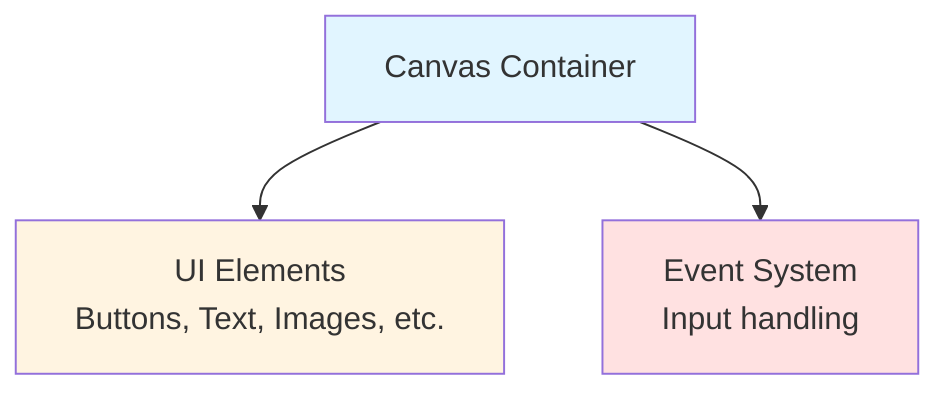
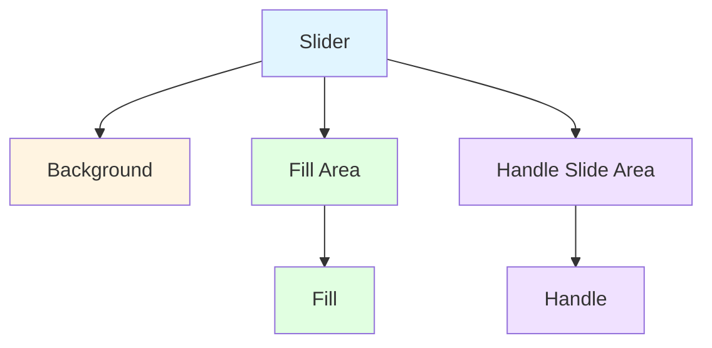
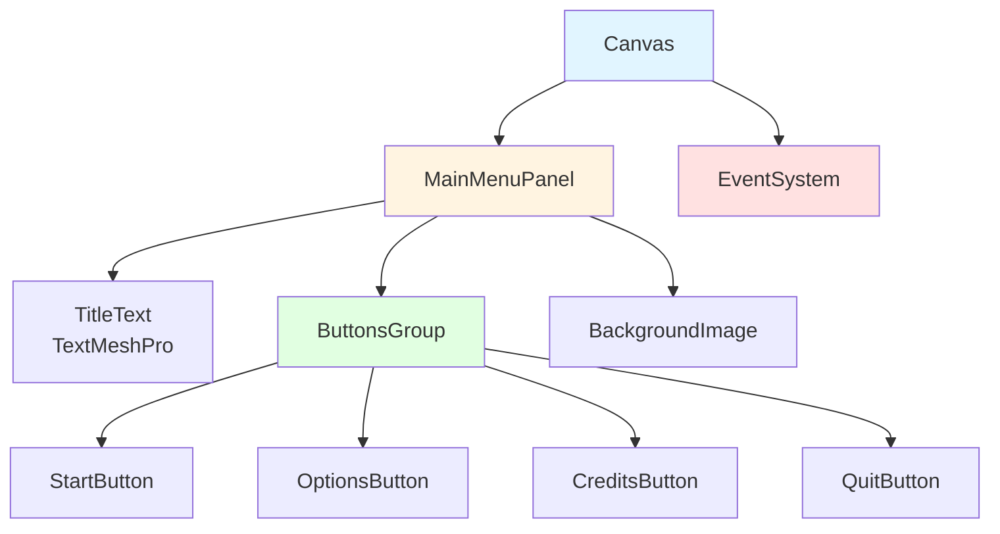
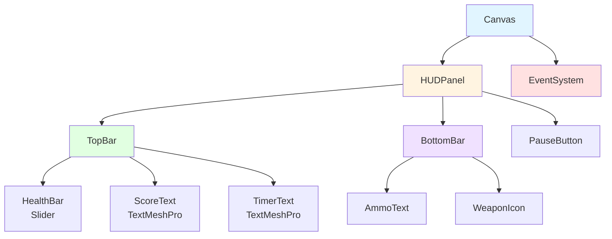

# UI System Setup - Complete Visual Guide

## 🎯 Learning Objectives

After following this guide, you will be able to:
- Create and configure Canvas for UI elements
- Set up UI components (Button, Text, Slider, Image, Panel)
- Configure Event System for UI interaction
- Set up UI navigation and event handlers
- Build complete menu systems
- Implement in-game HUD (Heads-Up Display)

---

## 📦 Step 1: Understanding Unity UI System

### 1.1 UI Component Hierarchy
Unity's UI system consists of three main parts:



### 1.2 Key Concepts
- **Canvas**: Root container for all UI elements
- **RectTransform**: 2D positioning system for UI
- **Event System**: Handles input events (clicks, hovers, etc.)
- **Graphic Raycaster**: Detects UI interactions
- **Anchors**: Makes UI responsive to different screen sizes

---

## 🎨 Step 2: Creating Your First Canvas

### 2.1 Create Canvas
1. In Hierarchy, right-click
2. Select **UI → Canvas**
3. Unity automatically creates:
   - Canvas GameObject
   - EventSystem GameObject

### 2.2 Understanding Canvas Components

#### Canvas Component
The Canvas component has three render modes:

**Screen Space - Overlay** (Most common for UI):
- Renders on top of everything
- Always visible
- Independent of camera
- Best for: Menus, HUD, pause screens

**Screen Space - Camera**:
- Renders on a specific camera
- Can be behind 3D objects
- Best for: World-space UI, VR interfaces

**World Space**:
- Positioned in 3D world
- Acts like a 3D object
- Best for: In-game billboards, quest markers

### 2.3 Canvas Scaler Component

The Canvas Scaler makes UI responsive across different screen sizes.

#### UI Scale Mode Options:

**Constant Pixel Size**:
- UI size stays the same regardless of screen size
- Not recommended for most games

**Scale With Screen Size** (Recommended):
- UI scales proportionally with screen resolution
- Best for most 2D and 3D games
- Settings:
  - **Reference Resolution**: 1920 x 1080 (standard HD)
  - **Match**: 0.5 (balance between width and height)
  - **Screen Match Mode**: Match Width Or Height

**Constant Physical Size**:
- UI size based on physical screen size (inches)
- Best for: Mobile applications

### 2.4 Recommended Canvas Settings

For most 2D games:
```
Canvas:
├── Render Mode: Screen Space - Overlay
├── Pixel Perfect: Unchecked (for smooth scaling)
└── Sort Order: 0

Canvas Scaler:
├── UI Scale Mode: Scale With Screen Size
├── Reference Resolution: 1920 x 1080
├── Screen Match Mode: Match Width Or Height
└── Match: 0.5
```

---

## 🎮 Step 3: Event System Configuration

### 3.1 Understanding Event System
The Event System handles all UI interactions:
- Mouse clicks
- Touch input
- Keyboard navigation
- Gamepad input

### 3.2 Event System Components

#### Standalone Input Module
Handles input for PC/Mac/Linux builds:
- **Horizontal Axis**: For UI navigation (left/right)
- **Vertical Axis**: For UI navigation (up/down)
- **Submit Button**: Confirm selection (Enter key)
- **Cancel Button**: Cancel/back (Escape key)

#### Input System UI Input Module (New Input System)
If using the new Input System:
1. Remove Standalone Input Module
2. Add **Input System UI Input Module**
3. Assign UI Input Actions asset

### 3.3 Graphic Raycaster
- Automatically added to Canvas
- Detects mouse/touch interactions
- No configuration needed for basic use

---

## 🔘 Step 4: Creating UI Buttons

### 4.1 Create Button
1. Select Canvas in Hierarchy
2. Right-click → **UI → Button - TextMeshPro**
3. Unity creates button with text child

### 4.2 Button Component Settings

#### Interactable
- **Checked**: Button can be clicked
- **Unchecked**: Button is disabled (grayed out)

#### Transition Types

**Color Tint** (Most common):
- Normal Color: Default state
- Highlighted Color: Mouse hover
- Pressed Color: When clicked
- Selected Color: When selected via keyboard/gamepad
- Disabled Color: When interactable is off
- Color Multiplier: Intensity of color change
- Fade Duration: Speed of color transition

**Sprite Swap**:
- Uses different sprites for each state
- Better for complex button designs
- Requires multiple sprite assets

**Animation**:
- Uses Animator for state changes
- Most flexible option
- Requires animation setup

### 4.3 Setting Up Button OnClick Event

1. Scroll to **OnClick()** section
2. Click **+** to add listener
3. Drag target GameObject to object field
4. Select function from dropdown:
   - **Static Parameters**: Predefined values
   - **Dynamic Parameters**: Runtime values

Example script:
```csharp
using UnityEngine;
using UnityEngine.SceneManagement;

public class MenuController : MonoBehaviour
{
    // Method with no parameters
    public void StartGame()
    {
        SceneManager.LoadScene("GameScene");
    }

    // Method with int parameter
    public void LoadLevel(int levelIndex)
    {
        SceneManager.LoadScene(levelIndex);
    }

    // Method with string parameter
    public void LoadSceneByName(string sceneName)
    {
        SceneManager.LoadScene(sceneName);
    }

    // Method to quit game
    public void QuitGame()
    {
        Application.Quit();
        #if UNITY_EDITOR
        UnityEditor.EditorApplication.isPlaying = false;
        #endif
    }
}
```

### 4.4 Button Best Practices
- Use clear, action-oriented text (e.g., "Start Game", not "Click Here")
- Provide visual feedback (hover effects)
- Use consistent button sizes across UI
- Ensure sufficient spacing between buttons
- Test keyboard/gamepad navigation

---

## 📝 Step 5: Text and TextMeshPro

### 5.1 TextMeshPro vs Legacy Text
**Always use TextMeshPro** (TMP):
- Better text quality
- Better performance
- More features (gradients, outlines, shadows)
- Better font rendering

### 5.2 Create TextMeshPro Text
1. Select Canvas
2. Right-click → **UI → Text - TextMeshPro**
3. If prompted, import TMP Essentials

### 5.3 TextMeshPro Settings

#### Text Input
- **Text**: Your actual text content
- **Font Asset**: TMP font file
- **Material Preset**: Text styling

#### Main Settings
- **Font Size**: Text size (adjust to fit)
- **Auto Size**: Automatically fit text to area
- **Color**: Text color
- **Vertex Color**: Gradient effects

#### Spacing Options
- **Character Spacing**: Space between letters
- **Word Spacing**: Space between words
- **Line Spacing**: Space between lines
- **Paragraph Spacing**: Space between paragraphs

#### Alignment
- **Horizontal**: Left, Center, Right, Justified
- **Vertical**: Top, Middle, Bottom, Baseline

#### Wrapping
- **Overflow**: What happens when text is too long
  - **Overflow**: Text continues outside bounds
  - **Ellipsis**: Adds "..." when text is truncated
  - **Truncate**: Cuts off excess text
  - **Scroll Rect**: Enables scrolling

### 5.4 Text Effects

**Outline**:
- Thickness: Size of outline
- Color: Outline color

**Underlay**:
- Shadow effects
- Offset: Shadow position
- Dilate: Shadow spread

**Glow**:
- Inner/outer glow effects
- Color and intensity

---

## 🎚️ Step 6: UI Slider Component

### 6.1 Create Slider
1. Select Canvas
2. Right-click → **UI → Slider**
3. Unity creates complete slider structure:


### 6.2 Slider Component Settings

#### Fill Rect
- Reference to Fill image
- Shows slider progress visually

#### Handle Rect
- Reference to Handle (draggable part)
- Can be disabled for display-only sliders

#### Direction
- **Left to Right**: Standard (e.g., health bars)
- **Right to Left**: Reverse (e.g., cooldown timers)
- **Bottom to Top**: Vertical (e.g., volume controls)
- **Top to Bottom**: Reverse vertical

#### Min/Max Value
- **Min Value**: Starting value (usually 0)
- **Max Value**: Maximum value (e.g., 100)

#### Whole Numbers
- **Checked**: Only integer values (1, 2, 3)
- **Unchecked**: Decimal values (1.5, 2.7, 3.9)

#### Value
- Current slider value
- Can be set in code

#### Interactable
- **Checked**: User can drag slider
- **Unchecked**: Display only (e.g., health bars)

### 6.3 Slider Events

**OnValueChanged()**:
- Triggered when slider value changes
- Passes float value to callback method

Example script:
```csharp
using UnityEngine;
using UnityEngine.UI;
using TMPro;

public class SliderController : MonoBehaviour
{
    [Header("References")]
    public Slider volumeSlider;
    public TextMeshProUGUI volumeText;

    void Start()
    {
        // Set initial value
        volumeSlider.value = 0.5f;

        // Add listener
        volumeSlider.onValueChanged.AddListener(OnVolumeChanged);
    }

    void OnVolumeChanged(float value)
    {
        // Update volume
        AudioListener.volume = value;

        // Update text display
        volumeText.text = $"Volume: {Mathf.RoundToInt(value * 100)}%";
    }
}
```

### 6.4 Common Slider Uses

**Health Bar** (Display Only):
```csharp
public class HealthBar : MonoBehaviour
{
    public Slider healthSlider;
    public float maxHealth = 100f;
    private float currentHealth;

    void Start()
    {
        healthSlider.interactable = false; // Display only
        healthSlider.maxValue = maxHealth;
        currentHealth = maxHealth;
        UpdateHealthBar();
    }

    public void TakeDamage(float damage)
    {
        currentHealth = Mathf.Max(0, currentHealth - damage);
        UpdateHealthBar();
    }

    void UpdateHealthBar()
    {
        healthSlider.value = currentHealth;
    }
}
```

**Volume Control** (Interactive):
```csharp
public class VolumeControl : MonoBehaviour
{
    public Slider volumeSlider;

    void Start()
    {
        volumeSlider.interactable = true; // User can adjust
        volumeSlider.minValue = 0f;
        volumeSlider.maxValue = 1f;
        volumeSlider.value = AudioListener.volume;
        volumeSlider.onValueChanged.AddListener(SetVolume);
    }

    void SetVolume(float value)
    {
        AudioListener.volume = value;
        PlayerPrefs.SetFloat("Volume", value);
    }
}
```

---

## 🖼️ Step 7: UI Image and Panels

### 7.1 Create Image
1. Select Canvas
2. Right-click → **UI → Image**

### 7.2 Image Component Settings

#### Source Image
- Sprite asset to display
- Can be left empty for solid color

#### Color
- Tint color applied to image
- Alpha channel controls transparency

#### Material
- Custom shader material
- Use for special effects

#### Raycast Target
- **Checked**: Image can receive click events
- **Unchecked**: Clicks pass through (better performance)

#### Image Type

**Simple**:
- Stretches sprite to fill RectTransform
- Default option

**Sliced**:
- Uses 9-slice scaling
- Preserves corners, stretches middle
- Best for: Buttons, panels, windows

**Tiled**:
- Repeats sprite pattern
- Best for: Backgrounds, patterns

**Filled**:
- Partially fills image based on fill amount
- Best for: Progress bars, radial cooldowns

### 7.3 Panel Setup

A Panel is just an Image component used as a container:
1. Create Image
2. Rename to "Panel"
3. Stretch to desired size
4. Add background sprite or solid color
5. Add child UI elements

**Panel Best Practices**:
- Use panels to group related UI elements
- Helps with organization and layout
- Can fade entire groups in/out
- Easier to enable/disable UI sections

---

## 📐 Step 8: RectTransform and Anchors

### 8.1 Understanding RectTransform

Every UI element has RectTransform (not regular Transform):
- **Anchors**: Define relative position
- **Pivot**: Center point for rotation/scaling
- **Position**: Offset from anchors
- **Size**: Width and height

### 8.2 Anchor Presets

Click the anchor square icon to see presets:

**Common Presets**:
- **Top Left**: UI stays in top-left corner
- **Top Center**: UI centered at top
- **Top Right**: UI stays in top-right corner
- **Center**: UI stays centered
- **Bottom Left/Center/Right**: Bottom positions
- **Stretch**: UI scales with screen size

**Holding Alt/Shift**:
- **Alt**: Set position while setting anchor
- **Shift**: Set pivot while setting anchor

### 8.3 Anchor Examples

**Health Bar (Top-Left)**:
```
Anchors: Min (0, 1), Max (0, 1)
Pivot: (0, 1)
Position: (20, -20)
```

**Pause Button (Top-Right)**:
```
Anchors: Min (1, 1), Max (1, 1)
Pivot: (1, 1)
Position: (-20, -20)
```

**Title Text (Top-Center)**:
```
Anchors: Min (0.5, 1), Max (0.5, 1)
Pivot: (0.5, 1)
Position: (0, -50)
```

**Full Screen Panel**:
```
Anchors: Min (0, 0), Max (1, 1)
Pivot: (0.5, 0.5)
Left/Right/Top/Bottom: 0
```

---

## 🎯 Step 9: Building a Complete Menu

### 9.1 Main Menu Structure



### 9.2 Menu Layout Tips

**Spacing**:
- Use consistent spacing between elements
- Group related items closer together
- Use empty GameObjects as spacers

**Alignment**:
- Align buttons to center for main menu
- Use vertical layout for button lists
- Consider horizontal layout for smaller options

**Visual Hierarchy**:
- Title text: Largest, bold
- Primary buttons: Medium, highlighted
- Secondary buttons: Smaller
- Labels: Smallest

### 9.3 Menu Controller Script

```csharp
using UnityEngine;
using UnityEngine.SceneManagement;

public class MainMenuController : MonoBehaviour
{
    [Header("UI Panels")]
    public GameObject mainMenuPanel;
    public GameObject optionsPanel;
    public GameObject creditsPanel;

    void Start()
    {
        ShowMainMenu();
    }

    public void ShowMainMenu()
    {
        mainMenuPanel.SetActive(true);
        optionsPanel.SetActive(false);
        creditsPanel.SetActive(false);
    }

    public void ShowOptions()
    {
        mainMenuPanel.SetActive(false);
        optionsPanel.SetActive(true);
        creditsPanel.SetActive(false);
    }

    public void ShowCredits()
    {
        mainMenuPanel.SetActive(false);
        optionsPanel.SetActive(false);
        creditsPanel.SetActive(true);
    }

    public void StartGame()
    {
        SceneManager.LoadScene("GameScene");
    }

    public void QuitGame()
    {
        Application.Quit();
        #if UNITY_EDITOR
        UnityEditor.EditorApplication.isPlaying = false;
        #endif
    }
}
```

---

## 🎮 Step 10: In-Game HUD (Heads-Up Display)

### 10.1 HUD Structure



### 10.2 HUD Manager Script

```csharp
using UnityEngine;
using UnityEngine.UI;
using TMPro;

public class HUDManager : MonoBehaviour
{
    [Header("Health")]
    public Slider healthSlider;
    public TextMeshProUGUI healthText;

    [Header("Score")]
    public TextMeshProUGUI scoreText;
    private int currentScore = 0;

    [Header("Timer")]
    public TextMeshProUGUI timerText;
    private float gameTime = 0f;

    void Update()
    {
        UpdateTimer();
    }

    public void UpdateHealth(float current, float max)
    {
        healthSlider.maxValue = max;
        healthSlider.value = current;
        healthText.text = $"{current:F0}/{max:F0}";
    }

    public void AddScore(int points)
    {
        currentScore += points;
        scoreText.text = $"Score: {currentScore}";
    }

    void UpdateTimer()
    {
        gameTime += Time.deltaTime;
        int minutes = Mathf.FloorToInt(gameTime / 60);
        int seconds = Mathf.FloorToInt(gameTime % 60);
        timerText.text = $"{minutes:00}:{seconds:00}";
    }
}
```

---

## 🎨 Step 11: UI Layout Groups

### 11.1 Horizontal Layout Group

Automatically arranges children horizontally:

**Settings**:
- **Padding**: Space around edges
- **Spacing**: Space between elements
- **Child Alignment**: How children align
- **Child Force Expand**: Make children fill space

### 11.2 Vertical Layout Group

Automatically arranges children vertically:

**Use Cases**:
- Button lists
- Settings menus
- Inventory grids (with Grid Layout)

### 11.3 Grid Layout Group

Arranges children in a grid:

**Settings**:
- **Cell Size**: Size of each cell
- **Spacing**: Space between cells
- **Start Corner**: Where to begin layout
- **Start Axis**: Horizontal or Vertical first
- **Constraint**: Fixed rows or columns

**Use Cases**:
- Inventory systems
- Level select grids
- Achievement displays

---

## ⚡ Step 12: UI Animation and Transitions

### 12.1 Simple Fade Animation

```csharp
using UnityEngine;
using UnityEngine.UI;
using System.Collections;

public class UIFadePanel : MonoBehaviour
{
    public CanvasGroup canvasGroup;
    public float fadeDuration = 0.5f;

    public void FadeIn()
    {
        StartCoroutine(FadeCoroutine(0f, 1f));
    }

    public void FadeOut()
    {
        StartCoroutine(FadeCoroutine(1f, 0f));
    }

    IEnumerator FadeCoroutine(float startAlpha, float endAlpha)
    {
        float elapsed = 0f;
        
        while (elapsed < fadeDuration)
        {
            elapsed += Time.deltaTime;
            float alpha = Mathf.Lerp(startAlpha, endAlpha, elapsed / fadeDuration);
            canvasGroup.alpha = alpha;
            yield return null;
        }
        
        canvasGroup.alpha = endAlpha;
    }
}
```

### 12.2 Scale Animation

```csharp
using UnityEngine;
using System.Collections;

public class UIScaleAnimation : MonoBehaviour
{
    public float scaleAmount = 1.1f;
    public float duration = 0.2f;
    private Vector3 originalScale;

    void Start()
    {
        originalScale = transform.localScale;
    }

    public void ScaleUp()
    {
        StartCoroutine(ScaleCoroutine(originalScale, originalScale * scaleAmount));
    }

    public void ScaleDown()
    {
        StartCoroutine(ScaleCoroutine(transform.localScale, originalScale));
    }

    IEnumerator ScaleCoroutine(Vector3 from, Vector3 to)
    {
        float elapsed = 0f;
        
        while (elapsed < duration)
        {
            elapsed += Time.deltaTime;
            transform.localScale = Vector3.Lerp(from, to, elapsed / duration);
            yield return null;
        }
        
        transform.localScale = to;
    }
}
```

---

## 🐛 Step 13: Common UI Issues and Solutions

### Issue 1: UI Not Visible
**Causes**:
- Canvas not in scene
- UI element outside camera view
- Alpha/transparency set to 0
- UI layer not rendered by camera

**Solutions**:
1. Check Canvas exists and is enabled
2. Check RectTransform is within screen bounds
3. Check Color alpha is not 0
4. Check Camera culling mask includes UI layer

### Issue 2: Button Not Clickable
**Causes**:
- No Event System in scene
- Raycast Target disabled
- Another UI element blocking clicks
- Button not marked Interactable

**Solutions**:
1. Ensure Event System exists
2. Enable Raycast Target on Image component
3. Check UI hierarchy (front elements block back elements)
4. Check Interactable checkbox is enabled

### Issue 3: UI Scales Incorrectly
**Causes**:
- Wrong Canvas Scaler settings
- Anchors not set correctly
- Reference resolution mismatch

**Solutions**:
1. Use "Scale With Screen Size" mode
2. Set Reference Resolution to target (1920x1080)
3. Set anchors correctly for each element
4. Test multiple resolutions

### Issue 4: Text Looks Blurry
**Causes**:
- Using Legacy Text instead of TextMeshPro
- Font size too small
- Wrong Canvas Scaler settings

**Solutions**:
1. Switch to TextMeshPro
2. Increase font size
3. Disable Pixel Perfect on Canvas
4. Ensure Canvas Scaler is properly configured

---

## ✅ Step 14: UI System Checklist

### Basic Setup
- [ ] Canvas created with correct render mode
- [ ] Canvas Scaler configured (Scale With Screen Size)
- [ ] Event System present and configured
- [ ] Reference resolution set (1920x1080)

### UI Elements
- [ ] Buttons have proper OnClick events
- [ ] Text using TextMeshPro (not Legacy Text)
- [ ] Sliders configured correctly
- [ ] Images have appropriate raycast settings
- [ ] Anchors set correctly for responsive design

### Organization
- [ ] UI elements grouped in panels
- [ ] Hierarchy clean and well-organized
- [ ] Naming conventions consistent
- [ ] Layout groups used where appropriate

### Testing
- [ ] Test on multiple resolutions
- [ ] Test keyboard navigation
- [ ] Test gamepad navigation (if applicable)
- [ ] Test touch input (for mobile)
- [ ] Check performance (draw calls)

---

## 📚 Next Steps

1. **Practice**: Create a complete menu system
2. **Experiment**: Try different UI layouts and styles
3. **Optimize**: Learn about UI batching and draw calls
4. **Advanced**: Explore UI animations and custom shaders
5. **Read Next**: [2D Project Setup Guide](../project-setup/2d-project-setup.md)

---

## 💡 Pro Tips

### Performance Optimization
- Disable Raycast Target on non-interactive elements
- Use Canvas groups to control visibility
- Pool UI elements instead of instantiating
- Minimize overdraw (overlapping UI elements)
- Use sprite atlases for UI images

### Design Best Practices
- Keep UI simple and intuitive
- Use consistent spacing and alignment
- Provide clear visual feedback
- Test with colorblind-friendly palettes
- Ensure text is readable at all sizes

### Accessibility
- Support keyboard/gamepad navigation
- Use high contrast for text
- Provide audio feedback for interactions
- Allow UI scale adjustment
- Test with accessibility tools

---

